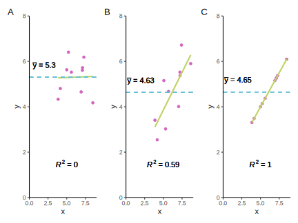
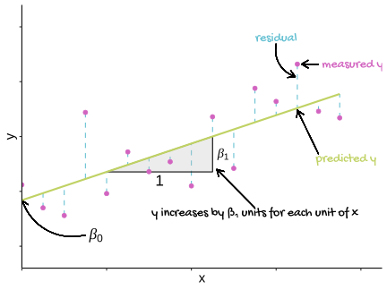
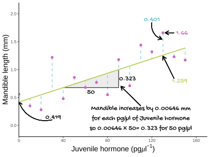
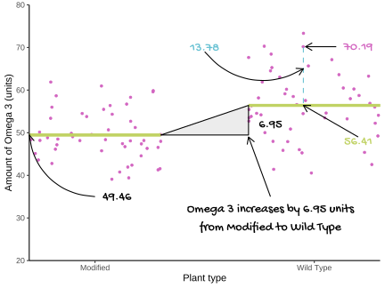
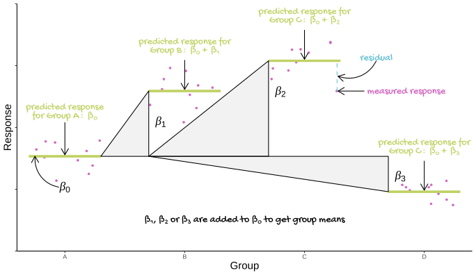

--- 
title: "gist-lm: Get Introductory Statistical Tests as Linear models: A guide for R users"
author: "Emma Rand"
date: "August 2020"
site: bookdown::bookdown_site
documentclass: book
bibliography: [refs/book.bib, refs/packages.bib]
biblio-style: apalike
link-citations: true
description: "The output format for this example is bookdown::gitbook."
favicon: images/favicon.ico
cover-image: images/hex-s.png
github-repo: 3mmaRand/singlm
url: 'https://3mmarand.github.io/gist-lm/'
always_allow_html: true
---
```{r include=FALSE, cache=FALSE}
# 
options(digits = 3)

knitr::opts_chunk$set(
  comment = "#",
  collapse = TRUE,
  out.width = "80%",
  fig.align = 'left',
  fig.show = "hold",
  warning = FALSE,
  message = FALSE,
  echo = TRUE
)

library(tidyverse, 
        verbose = FALSE, 
        quietly = TRUE, 
        warn.conflicts = FALSE)

library(kableExtra, 
        verbose = FALSE, 
        quietly = TRUE, 
        warn.conflicts = FALSE)
library(patchwork, 
        verbose = FALSE, 
        quietly = TRUE, 
        warn.conflicts = FALSE)


# might be of use
# options(dplyr.print_min = 6, dplyr.print_max = 6)


# pastel pallet for css boxes
#  blue, pink, green triadic
pal1 <- c("#eef8fa", "#faeef8","#f8faee")

#  blue, pink, green triadic
pal2 <- c("#9fd8e3", "#e39fd8", "#d8e39f")

#  blue, pink, green triadic
pal3 <- c("#64c0d2", "#d264c0", "#c0d264")

# blue, pink, green triadic
pal4 <- c("#256c7a", "#7a256c", "#6c7a25")
```

# Preface {-#preface}

```{r include=FALSE}
# automatically create a bib database for R packages
# knitr::write_bib(c(.packages(),
#                    "bookdown",
#                    "knitr",
#                    "rmarkdown",
#                    "tidyverse",
#                    "multcomp",
#                    "kableExtra"),
#                  "refs/packages.bib")
```


## Who is this book for?

This book designed to help people with a little experience of data analysis in R get the gist of linear models in R. It is aimed at non-specialists who have learned introductory data analysis as a skill for doing research in another field.  The audience I had in mind when writing the book are undergraduates on degree programmes in the life sciences who have done an introductory course covering hypothesis testing with single linear regression, *t*-tests, and ANOVA. However, students on social science, media, finance and education degree programmes often do similar introductory data analysis courses. This book can also help them, although the examples are from the life sciences. A short revision chapter giving an overview of introductory data analysis course is included to set the scene and clarify terminology used in the rest of the book. The coverage of single linear regression in the first chapter of Part 2 is also likely to be revision for most readers.

I assume you have an understanding of the rationale of hypothesis testing and some experience selecting, applying and interpreting tests. I also assume you have some familiarity with R and RStudio and have general, but not expert, proficiency in summarising, analysing and visualising data with functions such as `t.test()`, `aov()`, `TukeyHSD()` and `ggplot()`. I do not assume your fluency allows you to do these things without looking things up. 

The book has two aims. First to explain how the *t*-test, ANOVA and regression are actually all the same test and introduce the terminology of statistical modelling and, secondly, to teach you how to use and interpret the `lm()` function. 

## Approach of this book

Regression, *t*-tests and one-way ANOVA are special cases of a much more widely applicable statistical model known as the "general linear model". Since they are fundamentally the same test, all can be carried out with the `lm()` function in R. However, it is common for *t*-tests and ANOVA to be taught to non-specialists using the `t.test()` and `aov()` functions respectively. There are some sensible reasons for this. For example, many introductory texts take the same approach and typically, the outputs of `t.test()` and `aov()` are easier for beginners to understand and interpret. 

However, the output of `lm()` is more typical of statistical modelling functions in general and these are made harder to understand if you are not used to using `lm()` for the relatively simple cases. This makes the use of only slightly more advanced methods seem like a bigger leap in understanding than it really is, and extending your statistical repertoire more intimidating than it could be. The approach taken in this book is to exploit your pre-existing knowledge of *t*-tests and ANOVA using `t.test()` and `aov()` to understand the output of `lm()`. 

:::key
`lm()` can be used to perform *t*-tests, ANOVAs and regression. 
:::

Examples are carried out with the familiar functions and then with `lm()` so you can make the link between the two. Each example demonstrates the R code needed, how understand the output and how to report the results, including suggested **`ggplot2`** figures. 
The code is given for figures but, as this isn't a book about **`ggplot2`**, it is not extensively explained. Readers keen to learn more about **`ggplot2`** are advised to go to https://ggplot2.tidyverse.org/.


## Options on the toolbar 

You can change the appearance of the book using the toolbar at the top of the page. The menu on the left can be hidden, the font size increased or decreased and the colour altered to a dark or sepia theme.

Search the book by clicking on the magnifying glass, entering a search term and using the up and down arrows to navigate through the results.

## Conventions used in the book
Code and any output appears in blocks formatted like this:

```{r}
stag <- read_table2("data-raw/stag.txt")
glimpse(stag)
```

Lines of output start with a `#`. 

Within the text:
* packages are indicated in bold code font like this: **`ggplot2`**
* functions are indicated in code font with brackets after their name like this: `ggplot()`
* R objects are indicated in code font like this: `stag`

Key points are summarised throughout the book using boxes like this:

:::key
The key point of a previous few paragraphs is in boxes like these
:::

Extra pieces of information that are not essential to understanding the material are presented like this:

:::fyi
Extra information and tips are in boxes like these
:::


## Following along with the examples
Readers may wish to code along and the following gives guidance on how best to do that.

I recommend starting a new RStudio project and creating a folder inside that project called `data-raw` where you will save the data files. Links to the data files are given in the text and these can be downloaded to your `data-raw` folder by right-clicking the link choosing the option to save. Then make a new script file for each example to carry our the analysis for that example.


For example, if you call your Project `gist` and you have just started [Chapter 4 Single linear regression](#single-regression), your folder structure would look like this:

```
-- gist
   |-- gist.Rproj
   |-- stagbeetle_regresion.R
   |-- data-raw
      |-- stag.text

```

Using this structure will mean the paths to files needed in your code are the same as those given in the book.

The content of a code block can be copied using the icon in its top right corner.

I use packages from the **`tidyverse`** [@tidyverse2019] including **`ggplot2`** [@ggplot2-book], **`dplyr`** [@dplyr], **`tidyr`** [@tidyr] and **`readr`** [@readr] throughout the book. All the code assumes you have loaded the core **`tidyverse`** packages with: 

```{r eval=FALSE}
library(tidyverse)
```

If you run examples and get an error like this: 

```{r eval=FALSE}
# Error in read_table2("data-raw/stag.txt") : 
#  could not find function "read_table2"
```

It is likely you need to load the **`tidyverse`** as shown above.

All other packages will be loaded explicitly with `library()` statements where needed. 

##  Overview of the chapter contents

**Part 1 Introduction** provides a very brief overview of a typical introductory data analysis class using terminology that will used throughout the remaining chapters. If the concepts in this chapter are very unfamiliar, you may benefit from revising your previous work. 

In **Part 2**  we revise single linear regression which is likely where you have previously encountered the `lm()` function. We then
work through *t*-test, one-way ANOVA and two-way ANOVA examples carried out first with `t.test()` and `aov()` and then with `lm()` to gain a good understanding of the `lm()` output and interrogation for reporting.

I used the **`knitr`** package [@xie2015] and the **bookdown** package [@R-bookdown] to compile my book. My R session information is shown below:

```{r}
sessionInfo()
```


<!--chapter:end:index.Rmd-->

```{r include=FALSE, cache=FALSE}
# 
options(digits = 3)

knitr::opts_chunk$set(
  comment = "#",
  collapse = TRUE,
  out.width = "80%",
  fig.align = 'left',
  fig.show = "hold",
  warning = FALSE,
  message = FALSE,
  echo = TRUE
)

library(tidyverse, 
        verbose = FALSE, 
        quietly = TRUE, 
        warn.conflicts = FALSE)

library(kableExtra, 
        verbose = FALSE, 
        quietly = TRUE, 
        warn.conflicts = FALSE)
library(patchwork, 
        verbose = FALSE, 
        quietly = TRUE, 
        warn.conflicts = FALSE)


# might be of use
# options(dplyr.print_min = 6, dplyr.print_max = 6)


# pastel pallet for css boxes
#  blue, pink, green triadic
pal1 <- c("#eef8fa", "#faeef8","#f8faee")

#  blue, pink, green triadic
pal2 <- c("#9fd8e3", "#e39fd8", "#d8e39f")

#  blue, pink, green triadic
pal3 <- c("#64c0d2", "#d264c0", "#c0d264")

# blue, pink, green triadic
pal4 <- c("#256c7a", "#7a256c", "#6c7a25")
```
# (PART) INTRODUCTION {-}

# Revision of your Introductory class {#revision}
In experimental design and execution we manipulate, or choose, one or more variables and record the effect of this manipulation on another variable. The variables we manipulate  are called explanatory or predictor variables and the other is called the response. These are also known as independent and dependent variables respectively.

:::key
Predictor, Explanatory, *x* and Independent: all terms used to describe the variables we choose.  
:::

:::key
Predicted, Response, *y* and Dependent: all terms used to describe the variable we measure.
:::

When we plot data, the response variable goes on the *y*-axis and the explanatory variable goes on the *x*-axis. If we have two explanatory variables we need another way to visualise it. Often we might indicate the different values of a second explanatory variable with colour. The third explanatory variable can be displayed using different panels. See Figure \@ref(fig:expl-resp). 

(ref:expl-resp) Explanatory variables are placed on the *x*-axis and, if there is more than one, indicated with different colours (or shapes) and panels. The response variable is always on the *y*-axis. 


```{r expl-resp, echo=FALSE, fig.cap="(ref:expl-resp)"}
knitr::include_graphics("images/expl_rep_graph.svg")
```


In choosing between regression, *t*-tests, one-way ANOVA and two-way ANOVA we consider how many explanatory variables we have and whether they are continuous or categorical. 

If we have one continuous explanatory variable we can apply a regression. If the explanatory variable is categorical with two groups (or levels) we have the choice of a *t*-test or a one-way ANOVA, but when there are more than two groups we must use a one-way ANOVA. 

A two-way ANOVA is used when there are two categorical explanatory variables. See Figure \@ref(fig:decision-tree). 

(ref:decision-tree) Decision tree for choosing between single linear regression, *t*-tests, one-way ANOVA and two-way ANOVA.

```{r  decision-tree, echo=FALSE, fig.cap="(ref:decision-tree)", out.width="100%"}
knitr::include_graphics("images/decision_tree.svg")
```

These apparently different tests are, in fact, the same test. They have the same underlying mathematics, or to put it another way, they all follow the same model. That model is often known as the **General Linear Model**. 


<!--chapter:end:introductory-class-revision.Rmd-->

```{r include=FALSE, cache=FALSE}
# 
options(digits = 3)

knitr::opts_chunk$set(
  comment = "#",
  collapse = TRUE,
  out.width = "80%",
  fig.align = 'left',
  fig.show = "hold",
  warning = FALSE,
  message = FALSE,
  echo = TRUE
)

library(tidyverse, 
        verbose = FALSE, 
        quietly = TRUE, 
        warn.conflicts = FALSE)

library(kableExtra, 
        verbose = FALSE, 
        quietly = TRUE, 
        warn.conflicts = FALSE)
library(patchwork, 
        verbose = FALSE, 
        quietly = TRUE, 
        warn.conflicts = FALSE)


# might be of use
# options(dplyr.print_min = 6, dplyr.print_max = 6)


# pastel pallet for css boxes
#  blue, pink, green triadic
pal1 <- c("#eef8fa", "#faeef8","#f8faee")

#  blue, pink, green triadic
pal2 <- c("#9fd8e3", "#e39fd8", "#d8e39f")

#  blue, pink, green triadic
pal3 <- c("#64c0d2", "#d264c0", "#c0d264")

# blue, pink, green triadic
pal4 <- c("#256c7a", "#7a256c", "#6c7a25")
```
# What are General Linear Models {#what-are-linear-models}

## Overview
A general linear model describes a continuous response variable as a function of one or more explanatory variables. 
For a single explanatory variable, the model is:


\begin{equation}
E(y_{i})=\beta_{0}+\beta_{1}X1_{i}
(\#eq:lm1)
\end{equation}

Where:  

 - $y$ is the response variable and $X1$ is the explanatory variable.  
 - $i$ is the index of the values so $X1_{i}$ is the $i$th value of $X1$
 - $E(y_{i})$ is the expected value of $y$ for the $i$th value of $X1$. 
 - $\beta_{0}$ and $\beta_{1}$ are the coefficients - or parameters - in the model. In a single linear regression, $\beta_{0}$ is often called the intercept and $\beta_{1}$ the slope.  
 

The equation \@ref(eq:lm1) allows the response, $y$, to be predicted for a given value of the explanatory variable. 

Let's unpack what we mean by $E(y_{i})$, the expected value of $y$. If you measure the response for a particular value of $x$ very many times there would be some distribution of those responses. In the general linear model that distribution is assumed to be normal and its mean is the expected value for $y$, $E(y_{i})$.  

Another way of saying that is that in a general linear model, we "model the mean of the response". That the measured response is drawn from normal distribution with a mean of $E(y_{i})$ is a defining feature of the general linear model. 

An additional assumption is that those normal distributions have the same variance for all the $x$ values.

## Model fitting
The process of estimating the model coefficients from your data (set of chosen $X1$ with their measured $y$ values) is known as *fitting a linear model*. The coefficients are also known as parameters.

The measured response values in your data, $y_{i}$, will differ from the predicted values, $\hat{y}$, randomly and these random differences are known as *residuals* or *errors*. Our parameter values are chosen to minimise the sum of the squared residuals. A very commonly used abbreviation for the sum of the squared residuals (or errors) is $SSE$. 

\begin{equation}
SSE = \sum(y_{i}-\hat{y})^2
(\#eq:sse)
\end{equation}

Since the coefficient values are those that minimise the $SSE$, those values are known as *least squares estimates*. The mean of a sample is also a least squares estimate - 

The role played by $SSE$ in estimating our parameters means that it is also used in determining how well our model fits our data. Our model can be considered useful if its predictions are close to the observed data and the smaller the value of $SSE$, the better the fit. In other words, there is little random variance left over in the response. 
The absolute value of $SSE$ will depend on the size of the $y$ values and the sample size so it would be difficult to compare two models. Instead, we express it as a proportion of the total variation in $y$, $SST$: 

\begin{equation}
SSE / SST
(\#eq:rsq1)
\end{equation}

This is the proportion of variance left over after the model fitting. The proportion of variance explained by the model is a very commonly used metric of model fit and you have probably heard of it - R-squared, $R^2$. It is:

\begin{equation}
R^2=1-\frac{SSE}{SST}
(\#eq:rsq1)
\end{equation}

If there were no explanatory variables, the value we would predict for the response variable is its mean. Thus a good model should fit the response better than the mean. The output of `lm()` includes the $R^2$. It represents the proportional improvement in the predictions from the regression model relative to the mean model. It ranges from zero, the model is no better than the mean, to 1, the predictions are perfect. See Figure \@ref(fig:lm-fit).

(ref:lm-fit) A linear model with different fits. A) the model is a poor fit - the explanatory variable is no better than the response mean for predicting the response. B) the model is good fit - the explanatory variable explains a high proportion of the variance in the response. C) the model is a perfect fit - the response can be predicted perfectly from the explanatory variable.  Measured `r kableExtra::text_spec("response values are in pink", color = pal3[2], bold = TRUE)`, the `r kableExtra::text_spec("predictions are in green", color = pal3[3], bold = TRUE)` and the `r kableExtra::text_spec("dashed blue line gives the mean of the response", color = pal3[1], bold = TRUE)`.

```{r lm-fit, echo = FALSE, fig.cap="(ref:lm-fit)", out.width = "100%"} 

```

Since the distribution of the responses for a given $x$ is assumed to be normal and the variances of those distributions are assumed to be homogeneous, both are also true of the residuals. It is our examination of the residuals which allows us to evaluate whether the assumptions are met.

See Figure \@ref(fig:lm-annotated) for a graphical representation of linear modelling terms introduced so far. We will reference this figure in later chapters.

(ref:lm-annotated) A general linear model annotated with the terms used in modelling. The measured `r kableExtra::text_spec("response values are in pink", color = pal3[2], bold = TRUE)`, the `r kableExtra::text_spec("predictions are in green", color = pal3[3], bold = TRUE)`, and the differences between these, known as the `r kableExtra::text_spec("residuals, are in blue", color = pal3[1], bold = TRUE)`. The estimated model parameters, $\beta_{0}$ (the intercept) and $\beta_{1}$ (the slope) are indicated.

```{r lm-annotated, echo = FALSE, fig.cap="(ref:lm-annotated)"} 

```

## More than one explanatory variable

When you have more than one explanatory variable these are given as $X2$, $X3$ and so on up to the $p$th explanatory variable. Each explanatory variable has its own $\beta$ coefficient. 

The general form of the model is:
\begin{equation}
E(y_{i})=\beta_{0}+\beta_{1}X1_{i}+\beta_{2}X2_{i}+...+\beta_{p}Xp_{i}
(\#eq:lm2)
\end{equation}

The model has only one intercept which is the value of the response when all the explanatory variables are zero.

There is one problem with $R^2$ as a measure of model fit: the more explanatory variables that are added, the higher the $R^2$. This is true even if the added variables explain a really tiny amount of the variance in the response. Using $R^2$ to select a model would mean always choosing the model with the most variables in it. 
However, a key aim of statistical modelling is to understand the response and this is easier for simpler models. We want to find a balance between the complexity of the model and its explanatory power. The Adjusted $R^2$ is a way to achieve this. It reduces the $R^2$ for each coefficient added. 

A related reason for not including variables that explain only tiny amounts of variance is overfitting. Overfitting occurs when your model fits your data very well but does not generalise. We want models that would predict the response equally well for a new set of data.


## General linear models in R

### Building and viewing

*T*-tests and ANOVA, like regression, can be carried out with the `lm()` function in R. It uses the same method for specifying the model. When you have one explanatory variable the command is: 

<code>lm(data = *dataframe*, *response* ~ *explanatory*)</code>

The `response ~ explanatory` part is known as the model **formula**.

When you have two explanatory variable we add the second explanatory variable to the formula using a `+` or a `*`. The command is: 

<code>lm(data = *dataframe*, *response* ~ *explanatory1* + *explanatory2*)</code>

or

<code>lm(data = *dataframe*, *response* ~ *explanatory1* * *explanatory2*)</code>

A model with `explanatory1 + explanatory2` considers the effects of the two variables independently. A model with `explanatory1 * explanatory2` considers the effects of the two variables *and* any interaction between them. 

We usually assign the output of `lm()` commands to an object and view it with `summary()`. The typical workflow would be:

<code>
mod <- lm(data = *dataframe*, *response* ~ *explanatory*)  
summary(mod)
</code>

There are two sorts of statistical tests in the output of `summary(mod)`: tests of whether each coefficient is significantly different from zero; and an *F*-test of the model overall. 


The *F*-test in the last line of the output indicates whether the relationship modelled between the response and the set of explanatory variables is statistically significant. 


:::key
`lm()` can be used to perform tests using the General Linear Model including *t*-tests, ANOVA and regression for response variables which are normally distributed.
:::

Elements of the `lm()` object include the estimated coefficients, the predicted values and the residuals. These can be accessed with `mod$coeffients`, `mod$fitted.values` and `mod$residuals` respectively.

### Getting predictions
`mod$fitted.values` gives the predicted values for the explanatory variable values actually used in the experiment, *i.e.*, there is a prediction for each row of data. To get predictions for a different set of values we need to make a dataframe of the different set of values and use the `predict()` function. The typical workflow would be:

<code>
predict_for <- data.frame(*explanatory* = *values*)  
predict_for$pred <- predict(mod, newdata = predict_for)
</code>

### Checking assumptions

The assumptions of the model are checked using the `plot()` function which produces diagnostic plots to explore the distribution of the residuals. They are not proof of the assumptions being met but allow us to quickly determine if the assumptions are plausible, and if not, how the assumptions are violated and what data points contribute to the violation.

```{r echo=FALSE}
set.seed(1238)
b0 <- 4
b1 <- 2.5
n <- 100
x <- rnorm(n, mean = 10, sd = 2)
y <-  (b0 + b1 * x) + rnorm(n)
df <- data.frame(x = x, y = y)
mod <- lm(data = df, x ~ y)

```
The two plots which are most useful are the "Q-Q" plot (plot 2) and the "Residuals vs Fitted" plot (plot 1). These are given as values to the `which` argument of `plot()`.

#### The Q-Q plot
The Q-Q plot is a scatterplot of the residuals (standardised to a mean of zero and a standard deviation of 1) against what is expected if the residuals are normally distributed. 
```{r out.width="60%"}
plot(mod, which = 2)
```

The points should fall roughly on the line if the residuals are normally distributed. In the example above, the residuals appear normally distributed. 

The following are two examples in which the residuals are not normally distributed.
```{r echo=FALSE, out.width="60%"}
set.seed(100)
y <-  (b0 + b1 * x) + rexp(n,rate = 5)
df <- data.frame(x = x, y = y)
mod2 <- lm(data = df, x ~ y)
plot(mod2, which = 2)
```

If you see patterns like these you should find an alternative to a general linear model such as a non-parametric test or a generalised linear model. Sometimes, applying a transformation to the response variable will result in better meeting the assumptions.

#### The Residuals vs Fitted plot
```{r echo=FALSE, out.width="60%"}
set.seed(1234)
y <-  (b0 + b1 * x) + rpois(n,lambda = 1)
df <- data.frame(x = x, y = y)
mod3 <- lm(data = df, x ~ y)
plot(mod3, which = 2)
```


The Residuals vs Fitted plot shows if residuals have homogeneous variance or  non-linear patterns. Non-linear relationships between explanatory variables and the response will usually show in this plot if the model does not capture the non-linear relationship. For the assumptions to be met, the residuals should be equally spread around a horizontal line as they are here:
```{r out.width="60%"}
plot(mod, which = 1)
```

The following are two examples in which the residuals do not have homogeneous variance and display non-linear patterns.
```{r echo=FALSE, out.width="60%"}
set.seed(100)
y <-  (b0 + b1 * x) + rexp(n,rate = 0.1)
df <- data.frame(x = x, y = y)
mod2 <- lm(data = df, x ~ y)
plot(mod2, which = 1)
plot(mod3, which = 1)
```


## Reporting
The important information to include when reporting the results of fitting a linear model are the most notable predictions and the significance, direction and magnitude of effects. You need to ensure your reader will understand what the data are saying even if all the numbers and statistical information was removed. For example, that $A$ is much bigger than $B$ or variable $Y$ is influenced by variables $X1$ (a lot) and $X2$ (less so). 
In relatively simple models, reporting group means or a slope, and statistical test information is enough. In more complex models with many variables is it common to give all the estimated model coefficients in a table.

In addition, your figure should show both the data and the model. This is honest and allows your interpretation to be evaluated. 

<!--chapter:end:what-are-linear-models.Rmd-->

```{r include=FALSE, cache=FALSE}
# 
options(digits = 3)

knitr::opts_chunk$set(
  comment = "#",
  collapse = TRUE,
  out.width = "80%",
  fig.align = 'left',
  fig.show = "hold",
  warning = FALSE,
  message = FALSE,
  echo = TRUE
)

library(tidyverse, 
        verbose = FALSE, 
        quietly = TRUE, 
        warn.conflicts = FALSE)

library(kableExtra, 
        verbose = FALSE, 
        quietly = TRUE, 
        warn.conflicts = FALSE)
library(patchwork, 
        verbose = FALSE, 
        quietly = TRUE, 
        warn.conflicts = FALSE)


# might be of use
# options(dplyr.print_min = 6, dplyr.print_max = 6)


# pastel pallet for css boxes
#  blue, pink, green triadic
pal1 <- c("#eef8fa", "#faeef8","#f8faee")

#  blue, pink, green triadic
pal2 <- c("#9fd8e3", "#e39fd8", "#d8e39f")

#  blue, pink, green triadic
pal3 <- c("#64c0d2", "#d264c0", "#c0d264")

# blue, pink, green triadic
pal4 <- c("#256c7a", "#7a256c", "#6c7a25")
```
# Terminolgy

## General? Generalised?

Before we get started, I need to explain some potentially confusing terminology. I use the term "general linear model" to mean classical linear regression models of a continuous response variable explained by one or more continuous or categorical variables. These include regression, *t*-tests, analysis of variance (ANOVA) and analysis of covariance (ANCOVA). I use the term  "generalised linear model" or GLM to refer to a larger class of models formulated by  John Nelder and Robert Wedderburn [-@Nelder_Wedderburn1972] and popularised in "Generalized Linear Models", an influential book by Peter McCullagh and John Nelder [-@Mccullagh_Nelder1989]. In these models, the response variable can follow a number of other distributions including Poisson and binomial distributions. In some texts, the general linear model is referred to by the acronym GLM and the generalised linear model as GLIM but in this book I use GLM to refer to generalised linear models only.


<!--chapter:end:terminology.Rmd-->

```{r include=FALSE, cache=FALSE}
# 
options(digits = 3)

knitr::opts_chunk$set(
  comment = "#",
  collapse = TRUE,
  out.width = "80%",
  fig.align = 'left',
  fig.show = "hold",
  warning = FALSE,
  message = FALSE,
  echo = TRUE
)

library(tidyverse, 
        verbose = FALSE, 
        quietly = TRUE, 
        warn.conflicts = FALSE)

library(kableExtra, 
        verbose = FALSE, 
        quietly = TRUE, 
        warn.conflicts = FALSE)
library(patchwork, 
        verbose = FALSE, 
        quietly = TRUE, 
        warn.conflicts = FALSE)


# might be of use
# options(dplyr.print_min = 6, dplyr.print_max = 6)


# pastel pallet for css boxes
#  blue, pink, green triadic
pal1 <- c("#eef8fa", "#faeef8","#f8faee")

#  blue, pink, green triadic
pal2 <- c("#9fd8e3", "#e39fd8", "#d8e39f")

#  blue, pink, green triadic
pal3 <- c("#64c0d2", "#d264c0", "#c0d264")

# blue, pink, green triadic
pal4 <- c("#256c7a", "#7a256c", "#6c7a25")
```
# (PART) USING `lm()` FOR FAMILIAR TESTS {-}

# Single linear regression {#single-regression}

This is probably the one general linear model you have applied using `lm()` previously and it is covered here as revision and make more clear links between regression, *t*-tests and ANOVA.

## Introduction to the example

(ref:lucanus-fig) Male stag beetles *Lucanus cervus*, have large mandibles that resemble the antlers of a stag and give them their common and scientific name (*Cervus* is a genus of deer). By Simon A. Eugster - Own work, CC BY 3.0, https://commons.wikimedia.org/w/index.php?curid=7790887

```{r lucanus-fig, echo = FALSE, fig.cap='(ref:lucanus-fig)'}
knitr::include_graphics("images/640px-Lucanus_cervus_male_top_2.jpg")
```

The concentration of Juvenile growth hormone in male stag beetles (*Lucanus cervus*) is known to influence mandible growth. See Figure \@ref(fig:lucanus-fig)

Groups of ten stag beetles were treated with different concentrations of Juvenile growth hormone (pg$\mu$l^-1^) and their average mandible size (mm) determined. The data are in [stag.txt](data-raw/stag.txt). Juvenile hormone is has been set by the experimenter and we would expect mandible size to be normally distributed. 

```{r echo =FALSE}
stag <- read_table2("data-raw/stag.txt")
stag %>% 
  knitr::kable() %>%
  kable_styling()  %>%
  scroll_box(height = "300px")
```

:::key
There are 2 variables: `jh`, the concentration of Juvenile growth hormone and `mand`, the average mandible size (mm) of 10 stag beetles
:::


We will import the data with the `read_table2()` function from the **`readr`** package and plot it with `ggplot()` from the **`ggplot2`** package. Both packages are part of the tidyverse.

Import the data:
```{r eval=FALSE}
stag <- read_table2("data-raw/stag.txt")

```


Visualising our data before any further analysis is sensible. In this case, it will help us determine if any relationship between the two variables is linear.
A simple scatter plot is appropriate.

```{r}
ggplot(data = stag, aes(x = jh, y = mand)) +
        geom_point()
```
The relationship between the two variables looks roughly linear. So far, common sense suggests the assumptions of regression are met.

## Applying and interpreting `lm()`

The `lm()` function is used to build the regression model:

```{r}
mod <- lm(data = stag, mand ~ jh)
```


This can be read as: fit a linear of model of mandible size explained by the concentration of Juvenile growth hormone.

Printing `mod` to the console will reveal the estimated model parameters (coefficients) but little else:

```{r}
mod
```

```{r echo=FALSE}
res <- summary(mod)
b0 <- res$coefficients["(Intercept)", "Estimate"]
b1 <- res$coefficients["jh", "Estimate"]
b0se <- res$coefficients["(Intercept)", "Std. Error"]
b1se <- res$coefficients["jh", "Std. Error"]
if (res$coefficients["(Intercept)", "Pr(>|t|)"] < 0.001) {
        b0p = "< 0.001"
        }
if (res$coefficients["(Intercept)", "Pr(>|t|)"] > 0.001) {
        b0p = paste("=", round(res$coefficients["(Intercept)", "Pr(>|t|)"], 3))
        }
if (res$coefficients["jh", "Pr(>|t|)"] < 0.001) {
        b1p = "< 0.001"
        }
if (res$coefficients["jh", "Pr(>|t|)"] > 0.001) {
        b1p = paste("=", round(res$coefficients["jh", "Pr(>|t|)"], 3))
        }
rsq <- res$r.squared
if (anova(mod)$`Pr(>F)`[1] < 0.001) {
        modelp = "< 0.001"
        }
if (anova(mod)$`Pr(>F)`[1] > 0.001) {
        modelp = paste("=", round(anova(mod)$`Pr(>F)`[1], 3))
        }
```

$\beta_{0}$ is labelled `(Intercept)` and $\beta_{1}$ is labelled `jh`. Thus, the equation of the line is:

<center> $mand$ = `r b0` + `r b1`$jh$ </center>

More information, including statistical tests of the model and its parameters, is obtained by using `summary()`:
```{r}
summary(mod)

```

The `Coefficients` table gives the estimated $\beta_{0}$ and $\beta_{1}$ again but along with their standard errors and tests of whether the estimates differ from zero. The estimated value for the intercept is `r b0` $\pm$ `r b0se` and this differs significantly from zero ($p$ `r b0p`). The estimated value for the slope is `r b1` $\pm$ `r b1se`, also differs significantly from zero ($p$ `r b1p`). 

The three lines at the bottom of the output give information about the fit of the model to the data. The `Multiple R-squared` gives the proportion of the variance in the response which is explained by the model. In our case, `r rsq` of the variance in mandible length is explained by the model and this is a significant proportion of that variance ($p$ `r modelp`). 


The *p*-value for the model and the *p*-value for the slope are the same in a single linear regression because, except for the intercept, there is only one parameter (the slope) in the model. Linear models in the form of a two-sample *t*-test also estimate just one parameter and its *p*-value will also equal the model *p*-value. This is **not** the case for other linear models.

## Link to Chapter 2.1

The estimated coefficients tell us mandible size is predicted to be `r b0` when Juvenile growth hormone is zero and increases by 0.006 mm for each pg$\mu$l^-1^ of Juvenile growth hormone. 

At a Juvenile growth hormone of 1 pg$\mu$l^-1^  the mandible is predicted to be `r b0` + `r b1` = `r b0 + b1` mm. 

At 2 pg$\mu$l^-1^ the predicted mandible size is `r b0` + `r b1` + `r b1` = `r b0 + b1 + b1` mm. 


In general mandible size is: $\beta_{0}$ + $x\times\beta_{0}$ mm at $x$ pg$\mu$l^-1^. See Figure \@ref(fig:stag-annotated) for a version of Figure \@ref(fig:lm-annotated) annotated with values from this example.

(ref:stag-annotated) The model annotated with values from the stag beetle example. The measured `r kableExtra::text_spec("response values are in pink", color = pal3[2], bold = TRUE)`, the `r kableExtra::text_spec("predictions are in green", color = pal3[3], bold = TRUE)`, and the `r kableExtra::text_spec("residuals, are in blue", color = pal3[1], bold = TRUE)`. One example of a measured value, a predicted value and the residual is shown for a  Juvenile hormone of 130 pg$\mu$l^-1^. The estimated model parameters, $\beta_{0}$ and $\beta_{1}$ are indicated. Compare to Figure \@ref(fig:lm-annotated).

```{r stag-annotated, echo = FALSE, fig.cap="(ref:stag-annotated)"} 

```


## Getting predictions from the model

The `predict()` function returns the predicted values of the response. To add a column of predicted values to the `stag` dataframe we use: 

```{r }
stag$pred <- predict(mod)
glimpse(stag)
```
This gives predictions for the actual Juvenile growth hormone concentration values used. If you want predictions for other values, you need to create a data frame of the Juvenile growth hormone values from which you want to predict. 
The following creates a dataframe with one column of Juvenile growth hormone values from 0 to 150 in steps of 5:
```{r}
predict_for <- data.frame(jh = seq(0, 150, 5))
glimpse(predict_for)
```

Note that the column is named `jh` - the same as in the dataset and the model. Its variable type must also match.

:::key
To predict responses for a new set of explanatory variable values, the name and type of explanatory variables in the new set must match those in the model.
:::

To get predicted mandible sizes for the Juvenile growth hormone values we use:
```{r}
predict_for$pred <- predict(mod, newdata = predict_for)
glimpse(predict_for)

```


## Checking assumptions

The two assumptions of the model can be checked using diagnostic plots. The Q-Q plot is obtained with:
```{r}
plot(mod, which = 2)
```

This sample is relatively small so we should expect more wiggliness than we saw in 2.2 but this looks OK.

Let's look at the Residuals vs Fitted plot:

```{r}
plot(mod, which = 1)

```

Again the red line wiggles a little but there is no particular pattern and it appears that the variance is homogeneous along mandible size.

## Creating a figure

A suitable figure includes the data themselves and the model fitted:
```{r fig-reg}
ggplot(data = stag, aes(x = jh, y = mand)) +
        geom_point() +
        scale_x_continuous(expand = c(0.01, 0),
                           limits = c(0, 160),
                           name = expression(paste("Juvenile growth hormone (pg",
                                                   mu,
                                                   l^-1,
                                                   ")"))) +
        scale_y_continuous(expand = c(0, 0),
                           limits = c(0, 2),
                           name = "Mandible length (mm)") +
        geom_smooth(method = lm, se = FALSE, colour = "black") +
        theme_classic()
```


## Reporting the results

There was a significant positive relationship between the concentration of Juvenile growth hormone and mandible length ($\beta_{1}\pm s.e.$: `r b1` $\pm$ `r b1se`; $p$ `r b1p`). See figure \@ref(fig:fig-reg-report).

(ref:fig-reg-report) Relationship between the concentration of Juvenile growth hormone and mandible length. 

```{r fig-reg-report, ref.label = 'fig-reg', echo = FALSE, fig.height=4, fig.width=4, fig.cap="(ref:fig-reg-report)", out.width = "60%"} 
```


<!--chapter:end:single-linear-regression.Rmd-->

```{r include=FALSE, cache=FALSE}
# 
options(digits = 3)

knitr::opts_chunk$set(
  comment = "#",
  collapse = TRUE,
  out.width = "80%",
  fig.align = 'left',
  fig.show = "hold",
  warning = FALSE,
  message = FALSE,
  echo = TRUE
)

library(tidyverse, 
        verbose = FALSE, 
        quietly = TRUE, 
        warn.conflicts = FALSE)

library(kableExtra, 
        verbose = FALSE, 
        quietly = TRUE, 
        warn.conflicts = FALSE)
library(patchwork, 
        verbose = FALSE, 
        quietly = TRUE, 
        warn.conflicts = FALSE)


# might be of use
# options(dplyr.print_min = 6, dplyr.print_max = 6)


# pastel pallet for css boxes
#  blue, pink, green triadic
pal1 <- c("#eef8fa", "#faeef8","#f8faee")

#  blue, pink, green triadic
pal2 <- c("#9fd8e3", "#e39fd8", "#d8e39f")

#  blue, pink, green triadic
pal3 <- c("#64c0d2", "#d264c0", "#c0d264")

# blue, pink, green triadic
pal4 <- c("#256c7a", "#7a256c", "#6c7a25")
```
# *t*-tests revisited {#t-tests-revisit}

In this chapter we look at an example with one categorical explanatory variable which has two groups (or levels). We first use the familiar `t.test()` then use its output to help us understand the output of `lm()`. We will also make predictions from the model and report on our results.

## Introduction to the example

Some plant biotechnologists developed a genetically modified line of *Cannabis sativa* to increase its omega 3 fatty acids content. They grew 50 wild type and fifty modified plants to maturity, collect the seeds and measure the amount of omega 3 fatty acids (in arbitrary units). The data are in [csativa.txt](data-raw/csativa.txt). They want to know if the wild type and modified plants differ significantly in their omega 3 fatty acid content. 

```{r echo =FALSE}
csativa <- read_table2("data-raw/csativa.txt")
csativa %>%
  knitr::kable() %>%
  kable_styling() %>%
  scroll_box(height = "300px")
```

:::key
There are 2 variables. 
`plant` is the explanatory variable; it is categorical with 2 levels, `modif` and `wild`.
`omega`, a continuous variable, is the response.
:::

We again use the `read_table2()` function to import the data and visualise it with `ggplot()`


```{r eval=FALSE}
csativa  <-  read_table2("data-raw/csativa.txt")
```


A quick plot of the data:
```{r}
ggplot(data = csativa, aes(x = plant, y = omega)) +
  geom_violin()

```

:::fyi
Violin plots are a useful way to show the distribution of data in each group but not the only way. One alternative is `geom_boxplot()`.
:::


The modified plants have a lower mean omega 3 content than the wild type plants. The modification appears not to be successful! In fact, it may have significantly lowered the omega 3 content!

Let’s create a summary of the data that will be useful for plotting later:
```{r}
csativa_summary <- csativa %>%
  group_by(plant) %>%
  summarise(mean = mean(omega),
            std = sd(omega),
            n = length(omega),
            se = std/sqrt(n))
```

```{r echo=FALSE}
knitr::kable(csativa_summary, digits = 2)
```

Our summary confirms what we see in the plot.

Statistical comparison of the two means can be done with either the `t.test()` or `lm()` functions; these are **exactly** equivalent but present the results differently. We will use our understanding of applying and interpreting `t.test()` to develop our understanding of `lm()` output

## `t.test()` output reminder

We can apply a two-sample *t*-test with:

```{r}
t.test(data = csativa, omega ~ plant, var.equal = TRUE)
```
```{r echo=FALSE}
res <- t.test(data = csativa, omega ~ plant, var.equal = TRUE)
modifm <- res$estimate["mean in group modif"]
wildm <- res$estimate["mean in group wild"]
if (res$p.value < 0.001) {pval = "< 0.001"}
if (res$p.value > 0.001) {pval = paste("=", round(res$p.value), 3)}
tval <- res$statistic
df <- res$parameter
```


The two groups means are given in the section labelled `sample estimates` and the test of whether they differ significantly is given in the fourth line (beginning `t = -5, df = ...`). We conclude the mean omega 3 content of the modified plants (`r modifm` units) is significantly lower than that of the wild type plants ($t$ = `r abs(tval)`, $d.f.$ = `r df`, $p$ `r pval`).

The line under `95 percent confidence interval`gives the confidence limits on the difference between the two means.

The sign on the $t$ value and the confidence limits, and the order in which the sample estimates are given is determined by R's alphabetical ordering of the groups. As "modif" comes before "wild" in the alphabet, "modif" is the first group. The statistical test is: the modified plant mean $-$ the wild type mean. 

This ordering is arbitrary and has has no impact on our conclusions. If the wild type plants been labelled "control" so that "modif" would be the second group, our output would look like this:

```{r}
# 	Two Sample t-test
# 
# data:  omega by plant
# t = 5.0289, df = 98, p-value = 2.231e-06
# alternative hypothesis: true difference in means is not equal to 0
# 95 percent confidence interval:
#  4.205372 9.687828
# sample estimates:
# mean in group control  mean in group modif
#             56.4118             49.4652
# 
```

Our conclusion would remain the same: `r modifm` is significantly lower than `r wildm`.

:::key
`t.test()` output: the estimates are the two group means and the *p*-value is for a test on the difference between them.
:::

## *t*-tests as linear models

The equation for a *t*-test is just as it was for equation \@ref(eq:lm1):
\begin{equation}
E(y_{i})=\beta_{0}+\beta_{1}X1_{i}
(\#eq:t-test)
\end{equation}

Remember, in a single linear regression $\beta_{0}$, the intercept, is the value of the response when the numerical explanatory variable is zero. So what does this mean when the explanatory variable is categorical?

It means the intercept is the value of the response when the categorical explanatory is at its "lowest" level where the "lowest" level is the group which comes first alphabetically.

$X1_{i}$ is an indicator variable that takes the value of 0 or 1 and indicates whether the $i$th value was from one group or not. Such variables are known as **dummy explanatory variables**. They are dummy in the sense that they are numerical substitutes for the categorical variable whose 'real' values are the names of the categories.

You can think of $X1_{i}$ as toggling on and off the $\beta_{1}$ effect:

* If it has a value of 0 for a data point it means that $\beta_{1}$ will not impact the response. The response will be will be $\beta_{0}$.
* If it has a value 1 then $\beta_{1}$ will change the response to $\beta_{0}$ + $\beta_{1}$

$\beta_{1}$ is thus the *difference* between the group means.

A graphical representation of the terms in a linear model when the explanatory variable is categorical with two groups is given in Figure \@ref(fig:t-annotated). 

(ref:t-annotated) A linear model when the explanatory variable is categorical with two groups annotated with the terms used in linear modelling. The measured `r kableExtra::text_spec("response values are in pink", color = pal3[2], bold = TRUE)`, the `r kableExtra::text_spec("predictions are in green", color = pal3[3], bold = TRUE)`, and the differences between these, known as the `r kableExtra::text_spec("residuals, are in blue", color = pal3[1], bold = TRUE)`. The estimated model parameters are indicated: $\beta_{0}$ is the mean of group A and $\beta_{1}$ is what has to be added to $\beta_{0}$ to get the mean of group B. Compare to Figure \@ref(fig:lm-annotated).

```{r t-annotated, echo = FALSE, fig.cap="(ref:t-annotated)"} 
knitr::include_graphics("images/generic_t.svg")
```


## Applying and interpreting `lm()`

The `lm()` function is applied to this example as follows:
```{r}
mod <- lm(data = csativa, omega ~ plant)
```

This can be read as: fit a linear of model of omega content explained by plant type. Notice that the model formula is the same in both the `t.test()` and the `lm()` functions.

Printing `mod` to the console gives us the estimated model parameters (coefficients):

```{r}
mod
```

```{r echo=FALSE}
res <- summary(mod)
b0 <- res$coefficients["(Intercept)", "Estimate"]
b1 <- res$coefficients["plantwild", "Estimate"]
b0se <- res$coefficients["(Intercept)", "Std. Error"]
b1se <- res$coefficients["plantwild", "Std. Error"]
tval <- res$coefficients["plantwild", "t value"]
df <- res$df[2]

if (res$coefficients["(Intercept)", "Pr(>|t|)"] < 0.001) {
        b0p = "< 0.001"
        }
if (res$coefficients["(Intercept)", "Pr(>|t|)"] > 0.001) {
        b0p = paste("=", round(res$coefficients["(Intercept)", "Pr(>|t|)"], 3))
        }
if (res$coefficients["plantwild", "Pr(>|t|)"] < 0.001) {
        b1p = "< 0.001"
        }
if (res$coefficients["plantwild", "Pr(>|t|)"] > 0.001) {
        b1p = paste("=", round(res$coefficients["plantwild", "Pr(>|t|)"], 3))
        }
rsq <- res$r.squared
if (anova(mod)$`Pr(>F)`[1] < 0.001) {
        modelp = "< 0.001"
        }
if (anova(mod)$`Pr(>F)`[1] > 0.001) {
        modelp = paste("=", round(anova(mod)$`Pr(>F)`[1], 3))
        }

```

The equation for the model is:
<center> $omega$ = `r b0` + `r b1`$plantwild$ </center>

The first group of `plant` is `modif` so $\beta_{0}$ is the mean of the modified plants. $\beta_{1}$ is the coefficient labelled `plantwild`. In R, the coefficients are consistently named like this: variable name followed by the value without spaces. It means when the  variable `plant` takes the value `wild`, $\beta_{1}$ must be added to $\beta_{0}$

Thus, the mean omega 3 in the modified plants is `r b0` units and that in the wild type plants is `r b0` + `r b1` = `r b0 + b1` units.

More information including statistical tests of the model and its parameters is obtained by using `summary()`:

```{r}
summary(mod)
```
The `Coefficients` table gives the estimated $\beta_{0}$ and $\beta_{1}$ again but along with their standard errors and tests of whether the estimates differ from zero. The estimated mean of the modified plants is `r b0` $\pm$ `r b0se` and this differs significantly from zero ($p$ `r b0p`). The estimated difference between the modified and wild type plants is `r b1` $\pm$ `r b1se` and also differs significantly from zero ($p$ `r b1p`). The fact that this value is positive tells us that the wild type plants have a higher mean.

The proportion of the variance in the omega which is explained by the model is `r rsq` and this is a significant proportion of that variance ($p$ `r modelp`). 


As was true for single linear regression, the *p*-value for the model and the *p*-value for the difference between the means are the same because there is only one parameter in the model after the intercept. 


Replacing the terms shown in Figure \@ref(fig:t-annotated) with the values in this example gives us \@ref(fig:csat-annotated).

(ref:csat-annotated) The annotated model with the values from the Omega 3 content of *Cannabis sativa* example. The measured `r kableExtra::text_spec("response values are in pink", color = pal3[2], bold = TRUE)`, the `r kableExtra::text_spec("predictions are in green", color = pal3[3], bold = TRUE)`, and the `r kableExtra::text_spec("residuals, are in blue", color = pal3[1], bold = TRUE)`. One example of a measured value, a predicted value and the residual is shown for a wild type individual. The estimated model parameters are indicated: $\beta_{0}$, the mean of the modified plants, is `r b0` and $\beta_{1}$ is `r b1`. Thus the mean of wildtype plants is `r b0` + `r b1` = `r b0 + b1` units. Compare to Figure \@ref(fig:t-annotated).

```{r csat-annotated, echo = FALSE, fig.cap="(ref:csat-annotated)"} 

```


## Getting predictions from the model

We already have the predictions for all possible values of the explanatory variable because there are only two!

However the code for using predict is included here because it will make it easier to understand more complex examples later. We need to create a dataframe of  values for which we want predictions and pass it as an argument to the `predict()` function.

To create a dataframe with one column of Plant values:
```{r}
predict_for <- data.frame(plant = c("modif", "wild"))
```

:::key
Remember! The variable and its values have to exactly match those in the model. 
:::

The to get the predicted omega content for the two plant types:

```{r}
predict_for$pred <- predict(mod, newdata = predict_for)
glimpse(predict_for)
```


## Checking assumptions

The two assumptions of the model can be checked using diagnostic plots. The Q-Q plot is obtained with:
```{r}
plot(mod, which = 2)
```

The residual seem to be normally distributed.

Let's look at the Residuals vs Fitted plot:

```{r}
plot(mod, which = 1)

```

We get these two columns of points because the explanatory variable, `plant`, is categorical so the fitted - or predicted - values are just two means. In my view, the variance looks higher in the group with the higher mean (on the right).

## Creating a figure


```{r fig-ttest}
#summarise the data 

ggplot() +
  geom_jitter(data = csativa, 
              aes(x = plant, y = omega), 
              width = 0.25, colour = "grey") +
  geom_errorbar(data = csativa_summary,
                aes(x = plant,
                    ymin = mean,
                    ymax = mean),
                width = .3) +
  geom_errorbar(data = csativa_summary,
                aes(x = plant,
                    ymin = mean - se,
                    ymax = mean + se),
                width = .5) +
  geom_segment(aes(x = 1, y = 75, xend = 2, yend = 75),
               size = 1) +
  geom_segment(aes(x = 1, y = 75, xend = 1, yend = 73),
               size = 1) +
  geom_segment(aes(x = 2, y = 75, xend = 2, yend = 73),
               size = 1) +
  annotate("text", x = 1.5, y = 77,  label = "***", size = 6) +
  scale_x_discrete(labels = c("Modified", "Wild Type"),
                   name = "Plant type") +
  scale_y_continuous(name = "Amount of Omega 3 (units)",
                     expand = c(0, 0),
                     limits = c(0, 90)) +
  theme_classic()
```

## Reporting the results

The genetic modification was unsuccessful with wild type plants ($\bar{x} \pm s.e.$: `r csativa_summary[2,"mean"]` $\pm$ `r csativa_summary[2,"se"]` units) have significantly higher omega 3 than modified plants(`r csativa_summary[1,"mean"]` $\pm$ `r csativa_summary[1,"se"]` units) ($t$ = `r tval`; $d.f.$ = `r df`; $p$ `r b1p`). See figure \@ref(fig:fig-ttest-report).

(ref:ch1-ttest-report) Mean Omega 3 content of wild type and genetically modified *Cannabis sativa*. Error bars are $\pm 1 S.E.$. *** significant difference at the $p < 0.001$ level.  

```{r fig-ttest-report, ref.label = 'fig-ttest', echo = FALSE, fig.height=4, fig.width=4, fig.cap="(ref:ch1-ttest-report)", fig.align="left", out.width = "60%"} 
```


<!--chapter:end:t-test-revisit.rmd-->

```{r include=FALSE, cache=FALSE}
# 
options(digits = 3)

knitr::opts_chunk$set(
  comment = "#",
  collapse = TRUE,
  out.width = "80%",
  fig.align = 'left',
  fig.show = "hold",
  warning = FALSE,
  message = FALSE,
  echo = TRUE
)

library(tidyverse, 
        verbose = FALSE, 
        quietly = TRUE, 
        warn.conflicts = FALSE)

library(kableExtra, 
        verbose = FALSE, 
        quietly = TRUE, 
        warn.conflicts = FALSE)
library(patchwork, 
        verbose = FALSE, 
        quietly = TRUE, 
        warn.conflicts = FALSE)


# might be of use
# options(dplyr.print_min = 6, dplyr.print_max = 6)


# pastel pallet for css boxes
#  blue, pink, green triadic
pal1 <- c("#eef8fa", "#faeef8","#f8faee")

#  blue, pink, green triadic
pal2 <- c("#9fd8e3", "#e39fd8", "#d8e39f")

#  blue, pink, green triadic
pal3 <- c("#64c0d2", "#d264c0", "#c0d264")

# blue, pink, green triadic
pal4 <- c("#256c7a", "#7a256c", "#6c7a25")
```
# One-way ANOVA revisited {#one-way-anova-revisit}

In this chapter we again consider an example with one categorical explanatory variable. However, this time it has more than two groups (or levels). We first use the familiar `aov()` function to carry out a one-way ANOVA and then use that understanding to help us understand the output of `lm()`. We will also make predictions from the model and report on our results.


## Introduction to the example

(ref:weddell-fig) Baby Weddell Seals are very cute. By Photo © Samuel Blanc, CC BY-SA 3.0, https://commons.wikimedia.org/w/index.php?curid=3877642

```{r weddell-fig, echo = FALSE, fig.cap='(ref:weddell-fig)'}
knitr::include_graphics("images/Baby_Weddell_Seal.jpg")
```

The myoglobin concentration of skeletal muscle (in grams per kilogram of muscle) for three species of seal (see Figure \@ref(fig:weddell-fig)) is given in  [seal.txt](data-raw/seal.txt). 

```{r echo =FALSE}
seal <- read_delim("data-raw/seal.txt", delim = " ")
seal %>% 
  knitr::kable() %>%
  kable_styling()  %>%
  scroll_box(height = "300px")
```

The data were collected to determine whether muscle myoglobin differed between species.


:::key
There are 2 variables. 
`seal` is the explanatory variable; it is categorical with 3 levels, `Bladdernose Seal`, `Harbour Seal` and `Weddell Seal`.
`myoglobin`, a continuous variable, is the response.
:::

We can use the `read_delim()` function to import the data and visualise it with `ggplot()`.

```{r eval=FALSE}
seal <- read_delim("data-raw/seal.txt", delim = " ")
```

```{r}
# create a rough plot of the data  
ggplot(data = seal, aes(x = species, y = myoglobin)) +
  geom_violin()

```
Harbour Seals seem to have higher myoglobin than the other two species and the variance in myoglobin for the three species looks about the same.

Let's create a summary of the data that will be useful for plotting later:
```{r}
seal_summary <- seal %>%
  group_by(species) %>%
  summarise(mean = mean(myoglobin),
            std = sd(myoglobin),
            n = length(myoglobin),
            se = std/sqrt(n))
```

```{r echo=FALSE}
knitr::kable(seal_summary, digits = 2)
```

Our summary confirms that there are thirty individuals of each species and that highest mean is for Harbour Seals and the lowest is for Bladdernose Seals. The variance within each species is similar.


## `aov()` output reminder

The `aov()` function requires a model formula, `myoglobin ~ species`, in the familiar format. We also specify the `data` argument to indicate where the `species` and `myoglobin` variables can be found:


```{r}
mod <- aov(data = seal, myoglobin ~ species)
```
The output of the `summary()` function gives us an ANOVA test:
```{r}
summary(mod)
```

```{r echo=FALSE}
res <- summary(mod)[[1]]
df1 <- res$Df[1] 
df2 <- res$Df[2]
fval <- res$`F value`[1]
if (res$`Pr(>F)`[1] < 0.001) {
        pval = "< 0.001"
        }
if (res$`Pr(>F)`[1] > 0.001) {
        pval = paste("=", round(res$`Pr(>F)`[1], 3))
        }
```


There was a significant difference in myoglobin concentration between seal species (ANOVA: $F$ = `r fval`; $d.f.$ = `r df1`, `r df2`; $p$ `r pval`). We need a post-hoc multiple comparison test to discover which pairs of means differ significantly.

## Post-hoc testing for `aov()`

A commonly applied multiple comparison test applied after an significant ANOVA result is the Tukey Honest Significant Difference test:
```{r}
TukeyHSD(mod)
```

The *p*-value, adjusted for multiple comparisons is given in the `p adj` column. In this case, only one of the three pairwise comparisons is significant. Harbour Seals, with the highest myoglobin concentrations ($\bar{x} \pm s.e.$: `r seal_summary[2,"mean"]` $\pm$ `r seal_summary[2,"se"]`) ) were significantly higher than Bladdernose Seals with the lowest ($\bar{x} \pm s.e.$: `r seal_summary[1,"mean"]` $\pm$ `r seal_summary[1,"se"]`). 

The comparisons being made are known as contrasts and this terminology will appear later.

## One-way ANOVAs as linear models

The equation for a one-way ANOVA test is an extension of equation \@ref(eq:t-test) for a *t*-test. It has the same form but additional parameters. If there are three groups, the model is:

\begin{equation}
E(y_{i})=\beta_{0}+\beta_{1}X1_{i}+\beta_{2}X2_{i}
(\#eq:one-way)
\end{equation}


The parameter $\beta_{0}$, the intercept, is the value of the response when the categorical explanatory is at its "lowest" level. $X1_{i}$ and $X2_{i}$ are the dummy explanatory variables which take a value of 0 or 1 to toggle on and off the effects of $\beta_{1}$ and $\beta_{2}$ respectively.

$\beta_{1}$ is the difference between the mean of the group represented by the intercept and the next group and $\beta_{2}$ is the difference between the mean of the group represented by the intercept and the group after that.

An additional parameter and dummy variable are added for each additional group so for four groups the equation is:

\begin{equation}
E(y_{i})=\beta_{0}+\beta_{1}X1_{i}+\beta_{2}X2_{i}+\beta_{3}X3_{i}
(\#eq:one-way2)
\end{equation}


A graphical representation of the terms in a linear model when the explanatory variable is categorical with four groups is given in Figure \@ref(fig:one-way-annotated). 

(ref:one-way-annotated) A linear model when the explanatory variable is categorical with four groups annotated with the terms used in linear modelling. The measured `r kableExtra::text_spec("response values are in pink", color = pal3[2], bold = TRUE)`, the `r kableExtra::text_spec("predictions are in green", color = pal3[3], bold = TRUE)`, and the differences between these, known as the `r kableExtra::text_spec("residuals, are in blue", color = pal3[1], bold = TRUE)`. The estimated model parameters are indicated: $\beta_{0}$ is the mean of group A; $\beta_{1}$ is what has to be added to $\beta_{0}$ to get the mean of group B; $\beta_{2}$ is what has to be added to $\beta_{0}$ to get the mean of group C; and $\beta_{3}$ is what has to be added to $\beta_{0}$ to get the mean of group D. In this figure, $\beta_{1}$ and $\beta_{2}$ are positive and $\beta_{3}$ is negative.  Compare to Figure \@ref(fig:lm-annotated).

```{r one-way-annotated, echo = FALSE, fig.cap="(ref:one-way-annotated)"} 

```

:::key
All the $\beta$ values are given relative to $\beta_{0}$. Their sign indicates whether a group mean is bigger (positive) or smaller (negative) than the intercept.
:::

## Applying and interpreting `lm()`

The `lm()` function is applied to the seal example as follows:

```{r}
mod <- lm(data = seal, myoglobin ~ species)
```
Printing `mod` to the console gives us the estimated model parameters (coefficients):

```{r}
mod
```
```{r echo=FALSE}
res <- summary(mod)
b0 <- res$coefficients["(Intercept)", "Estimate"]
b1 <- res$coefficients["speciesHarbour Seal", "Estimate"]
b2 <- res$coefficients["speciesWeddell Seal", "Estimate"]
b0se <- res$coefficients["(Intercept)", "Std. Error"]
b1se <- res$coefficients["speciesHarbour Seal", "Std. Error"]
b2se <- res$coefficients["speciesWeddell Seal", "Std. Error"]
tval1 <- res$coefficients["speciesHarbour Seal", "t value"]
tval2 <- res$coefficients["speciesWeddell Seal", "t value"]
df <- res$df[2]

if (res$coefficients["(Intercept)", "Pr(>|t|)"] < 0.001) {
        b0p = "< 0.001"
        }
if (res$coefficients["(Intercept)", "Pr(>|t|)"] > 0.001) {
        b0p = paste("=", round(res$coefficients["(Intercept)", "Pr(>|t|)"], 3))
        }
if (res$coefficients["speciesHarbour Seal", "Pr(>|t|)"] < 0.001) {
        b1p = "< 0.001"
        }
if (res$coefficients["speciesHarbour Seal", "Pr(>|t|)"] > 0.001) {
        b1p = paste("=", round(res$coefficients["speciesHarbour Seal", "Pr(>|t|)"], 3))
}
if (res$coefficients["speciesWeddell Seal", "Pr(>|t|)"] < 0.001) {
        b2p = "< 0.001"
        }
if (res$coefficients["speciesWeddell Seal", "Pr(>|t|)"] > 0.001) {
        b2p = paste("=", round(res$coefficients["speciesWeddell Seal", "Pr(>|t|)"], 3))
        }
rsq <- res$r.squared
if (anova(mod)$`Pr(>F)`[1] < 0.001) {
        modelp = "< 0.001"
        }
if (anova(mod)$`Pr(>F)`[1] > 0.001) {
        modelp = paste("=", round(anova(mod)$`Pr(>F)`[1], 3))
        }

```

The equation for the model is:
<center> $myoglobin$ = `r b0` + `r b1`$speciesHarbour Seal$ + `r b2`$speciesWeddell Seal$</center>

The first group of `seal` is `Bladdernose Seal` so $\beta_{0}$ is the mean of the Bladdernose seals. $\beta_{1}$ is the coefficient labelled `speciesHarbour Seal` and means when the  variable `species` takes the value `Harbour Seal`, $\beta_{1}$ must be added to $\beta_{0}$. The last parameter, $\beta_{2}$, is the coefficient labelled `speciesWeddell Seal` and means when the  variable `species` takes the value `Weddell Seal`, $\beta_{2}$ must be added to $\beta_{0}$.

The mean myoglobin in Bladdernose seals is `r b0` kg g^-1^, that in Harbour Seals is `r b0` + `r b1` = `r b0 + b1` kg g^-1^ and in Weddell Seals is `r b0` + `r b2` = `r b0 + b2`kg g^-1^.

More information including statistical tests of the model and its parameters is obtained by using `summary()`:

```{r}
summary(mod)
```
The `Coefficients` table gives the estimated $\beta_{0}$, $\beta_{1}$ and $\beta_{2}$ again but along with their standard errors and tests of whether the estimates differ from zero. The estimated mean of the Bladdernose seals is `r b0` $\pm$ `r b0se` kg g^1^ and this differs significantly from zero ($p$ `r b0p`). The estimated difference between the Bladdernose and Harbour seals is `r b1` $\pm$ `r b1se` and also differs significantly from zero ($p$ `r b1p`). The estimated difference between the Bladdernose and Weddell seals, `r b2` $\pm$ `r b2se` kg g^1^, does not differ significantly from zero ($p$ `r b2p`). The fact that both parameters are positive tells us both of the other two species have higher means than Bladdernose. 

The proportion of the variance in the omega which is explained by the model is `r rsq` and this is a significant proportion of that variance ($p$ `r modelp`). 


This is the first time we have a model where the *p*-value for the model and the *p*-values for the $\beta$ parameters differ. This is because we are fitting two parameters after the intercept. 


Replacing the terms shown in Figure \@ref(fig:one-way-annotated) with the values in this example gives us \@ref(fig:seal-annotated).

(ref:seal-annotated) The annotated model with the values from the Seal species example. The measured `r kableExtra::text_spec("response values are in pink", color = pal3[2], bold = TRUE)`, the `r kableExtra::text_spec("predictions are in green", color = pal3[3], bold = TRUE)`, and the `r kableExtra::text_spec("residuals, are in blue", color = pal3[1], bold = TRUE)`. One example of a measured value, a predicted value and the residual is shown for an individual harbour seal. The estimated model parameters are indicated: $\beta_{0}$, the mean of the Bladdernose Seals, is `r b0` kg g^1^;  $\beta_{1}$ is `r b1` thus the mean of Harbour Seals `r b0` + `r b1` = `r b0 + b1` kg g^-1; and $\beta_{2}$ is `r b2` thus the mean of Weddell Seals `r b0` + `r b2` = `r b0 + b1` kg g^-1^. Compare to Figure \@ref(fig:one-way-annotated).

```{r seal-annotated, echo = FALSE, fig.cap="(ref:seal-annotated)"} 
knitr::include_graphics("images/seal_lm_eg.svg")
```


## Getting predictions from the model

We already have the predictions for all possible values of the explanatory variable because it is categorical.

However, the code for using predict is included here, as it was in the last chapter, because it will make it easier to understand more complex examples later. We need to create a dataframe of values for which we want predictions and pass it as an argument to the predict() function.

To create a dataframe with one column of Species values:

```{r}
predict_for <- data.frame(species = c("Bladdernose Seal",
                                      "Harbour Seal",
                                      "Weddell Seal"))
```

:::key
Remember! The variable and its values have to exactly match those in the model.
:::

The to get the predicted myoglobin content for the three species:

```{r}
predict_for$pred <- predict(mod, newdata = predict_for)
```


## Checking assumptions

The two assumptions of the model can be checked using diagnostic plots. The Q-Q plot is obtained with:

```{r}
plot(mod, which = 2)
```
The residual seem to be normally distributed.

Let’s look at the Residuals vs Fitted plot:

```{r}
plot(mod, which = 1)
```

The residuals are equally spread around a horizontal line; the assumptions seem to be met.


## Post-hoc testing for `lm()`

Instead of using the `TukeyHSD()` we will use the `glht()` (**g**eneralized **l**inear **h**ypothesis **t**est) function from the `multcomp` package [@multcomp]. This is function that can be applied more widely than `TukeyHSD()`. It provides multiple comparisons for linear models, generalised linear models and linear mixed effects models. This tremendous flexibility comes at some cost and the arguments for the `glht()` function are relatively complex. However, you don't need a full understanding to be able to use it.

`glht()` requires our `species` variable to be a factor so our first task is to transform that variable and rebuild our model:
```{r}
seal$species <- factor(seal$species)
mod <- lm(data = seal, myoglobin ~ species)
```

Then load the package:
```{r}
library(multcomp)
```

We have to specify our contrasts as a matrix with the `linfct` (linear functions) argument and there is a multiple comparisons function, `mcp()`, to help.

This is the whole command:

```{r}
mod_mc <- glht(mod, linfct = mcp(species = "Tukey"))
```
You can read this as "do all of the pairwise comparisons between each species in the model `mod` using the Tukey test".

We view the results with `summary()`:

```{r}
summary(mod_mc)
```

The results are the same as for using `TukeyHSD()` as we have done the same tests using a different function.

You can see what a contrasts matrix looks like by looking at the `linfct` variable of the `glht` object. You don't need it now but in the future you may need to specify your own contrasts matrices so let's have a quick look to aid your journey towards understanding:

```{r}
mod_mc$linfct
```
It is matrix with a column for each parameter, in order) and a row for each contrast containing only 0s, 1s and -1s. The rows are named.
The numbers are how the model parameters are needed to make the contrast and these can be understood by considering how the group means relate to the parameters.

* Bladdernose mean is $\beta_{0}$ 
* Harbour mean is $\beta_{0} + \beta_{1}$ 
* Weddell mean is $\beta_{0} + \beta_{2}$ 

Therefore: 

* Harbour Seal - Bladdernose Seal is: $\beta_{0} + \beta_{1} - \beta_{0} = \beta_{1}$ and there is a one in the `speciesHarbour Seal` column and zeros else where
* Weddell Seal - Bladdernose Seal is: $\beta_{0} + \beta_{2} - \beta_{0} = \beta_{2}$ and there is a one in the `speciesWeddell Seal` column and zeros else where
* Weddell Seal - Harbour Seal is: $\beta_{0} + \beta_{2} - (\beta_{0} + \beta_{1}) = \beta_{2} - \beta_{1}$ and there is a 1 in the the `speciesWeddell Seal` column and a -1 in the  `speciesHarbour Seal` column.

## Creating a figure

```{r fig-one-anova}
#summarise the data 

ggplot() +
  geom_jitter(data = seal, 
              aes(x = species, y = myoglobin), 
              width = 0.25, colour = "grey") +
  geom_errorbar(data = seal_summary,
                aes(x = species,
                    ymin = mean,
                    ymax = mean),
                width = .3) +
  geom_errorbar(data = seal_summary,
                aes(x = species,
                    ymin = mean - se,
                    ymax = mean + se),
                width = .5) +
  geom_segment(aes(x = 1, y = 71, xend = 3, yend = 71),
               size = 1) +
  geom_segment(aes(x = 1, y = 71, xend = 1, yend = 69),
               size = 1) +
  geom_segment(aes(x = 3, y = 71, xend = 3, yend = 69),
               size = 1) +
  annotate("text", x = 2, y = 73,  label = "**", size = 6) +
  scale_x_discrete(name = "Species") +
  scale_y_continuous(name = expression("Myoglobin concentration g "*Kg^{-1}),
                     expand = c(0, 0),
                     limits = c(0, 75)) +
  theme_classic()
```

## Reporting the results

```{r echo=FALSE}
res2 <- summary(mod_mc)
if (res2$test$pvalues[1] < 0.001) {
        mcp = "< 0.001"
        }
if (res2$test$pvalues[1] > 0.001) {
        mcp = paste("=", round(res2$test$pvalues[1], 3))
        }


```


There is a significant difference in myoglobin concentration between Seal species (ANOVA: $F$ = `r fval`; $d.f.$ = `r df1`, `r df2`; $p$ `r pval`). Post-hoc testing revealed that difference to be between the Harbour Seal with the highest myoglobin concentrations ($\bar{x} \pm s.e.$: `r seal_summary[2,"mean"]` $\pm$ `r seal_summary[2,"se"]`) ) and the Bladdernose Seal(`r mcp`) with the lowest ($\bar{x} \pm s.e.$: `r seal_summary[1,"mean"]` $\pm$ `r seal_summary[1,"se"]`). See figure \@ref(fig:fig-one-anova-report).

(ref:fig-one-anova-report) Muscle myoglobin content of three seal species. Error bars are $\pm 1 S.E.$. ** significant difference at the $p < 0.001$ level.  

```{r fig-one-anova-report, ref.label = 'fig-one-anova', echo = FALSE, fig.height=4, fig.width=4, fig.cap="(ref:fig-one-anova-report)", out.width="60%"} 
```


<!--chapter:end:one-way-anova-revisit.Rmd-->

```{r include=FALSE, cache=FALSE}
# 
options(digits = 3)

knitr::opts_chunk$set(
  comment = "#",
  collapse = TRUE,
  out.width = "80%",
  fig.align = 'left',
  fig.show = "hold",
  warning = FALSE,
  message = FALSE,
  echo = TRUE
)

library(tidyverse, 
        verbose = FALSE, 
        quietly = TRUE, 
        warn.conflicts = FALSE)

library(kableExtra, 
        verbose = FALSE, 
        quietly = TRUE, 
        warn.conflicts = FALSE)
library(patchwork, 
        verbose = FALSE, 
        quietly = TRUE, 
        warn.conflicts = FALSE)


# might be of use
# options(dplyr.print_min = 6, dplyr.print_max = 6)


# pastel pallet for css boxes
#  blue, pink, green triadic
pal1 <- c("#eef8fa", "#faeef8","#f8faee")

#  blue, pink, green triadic
pal2 <- c("#9fd8e3", "#e39fd8", "#d8e39f")

#  blue, pink, green triadic
pal3 <- c("#64c0d2", "#d264c0", "#c0d264")

# blue, pink, green triadic
pal4 <- c("#256c7a", "#7a256c", "#6c7a25")
```
# Two-way ANOVA revisited {#two-way-anova-revisit}

In this chapter we turn our attention to designs with two categorical explanatory variables. We will use the same approach that we used in the previous two chapters: first using the familiar `aov()` function to carry out a two-way ANOVA and then the `lm()` function. We will also make predictions from the model and report on our results.


## Introduction to the example

Researchers have collected live specimens of two species of periwinkle (see Figure \@ref(fig:periwinkle-fig)) from sites in northern England in the Spring and Summer. They take a measure of the gut parasite load by examining a slide of gut contents. The data are in [periwinkle.txt](data-raw/periwinkle.txt).

(ref:periwinkle-fig) Periwinkles are marine gastropod molluscs (slugs and snails). A) *Littorina brevicula* (PD files - Public Domain, https://commons.wikimedia.org/w/index.php?curid=30577419) B) *Littorina littorea*. (photographed by Guttorm Flatabø (user:dittaeva). - Photograph taken with an Olympus Camedia C-70 Zoom digital camera. Metainformation edited with Irfanview, possibly cropped with jpegcrop., CC BY-SA 3.0, https://commons.wikimedia.org/w/index.php?curid=324769

```{r periwinkle-fig, echo = FALSE, fig.cap='(ref:periwinkle-fig)'}
knitr::include_graphics("images/Littorina.jpg")

```


```{r echo =FALSE}
periwinkle <- read_delim("data-raw/periwinkle.txt", delim = "\t")
periwinkle %>% 
  knitr::kable() %>%
  kable_styling()  %>%
  scroll_box(height = "300px")
```

The data were collected to determine whether there was an effect of season or species on parasite load and whether these effects were independent.


:::key
There are 3 variables: `species` and `season`are categorical explanatory variables, each with two levels;
`para`, a continuous variable, is the response.
:::

We can use the `read_delim()` function to import the data.

```{r eval=FALSE}
periwinkle <- read_delim("data-raw/periwinkle.txt", delim = "\t")
```

When visualising this data with `ggplot()` we need to account for both explanatory variables. We can map one to the *x*-axis and the other to a different aesthetic. Using the `fill` aesthetic works well for violin plots. 


```{r}
ggplot(data = periwinkle, aes(x = season, y = para, fill = species)) +
  geom_violin()
```
Parasite load seems to be higher for both species in the summer and that effect looks bigger in *L.brevicula* - it has the lowest spring mean but the highest summer mean.

Let’s create a summary of the data that will be useful for plotting later:
```{r}
peri_summary <- periwinkle %>% 
  group_by(season, species) %>% 
  summarise(mean = mean(para),
            sd = sd(para),
            n = length(para),
            se = sd / sqrt(n))
```

```{r echo=FALSE}
knitr::kable(peri_summary, digits = 2)
```

The summary confirms both species have a higher mean in the summer and that the difference between the species is reversed - *L.brevicula* $-$ *L.littorea* is `r peri_summary$mean[1]-peri_summary$mean[2]` in the spring but `r peri_summary$mean[3]-peri_summary$mean[4]` in summer.

## `aov()` output reminder

The `aov()` function requires a model formula which includes both explanatory variables and the interaction between them in the familiar format: `para ~ season * season` . We also specify the data argument to indicate where the variables can be found:

```{r}
mod <- aov(data = periwinkle, para ~ season * species)
```

The output of the `summary()` function gives us an ANOVA test:

```{r}
summary(mod)
```

```{r echo=FALSE}
res <- summary(mod)[[1]]
df_seas <- res$Df[1]
df_sp <- res$Df[2]
df_seasxsp <- res$Df[3]
df_err <- res$Df[4]
fval_seas <- res$`F value`[1]
fval_sp <- res$`F value`[2]
fval_seasxsp <- res$`F value`[3]
if (res$`Pr(>F)`[1] < 0.001) {
        pval_seas = "< 0.001"
        }
if (res$`Pr(>F)`[1] > 0.001) {
        pval_seas = paste("=", round(res$`Pr(>F)`[1], 3))
        }
if (res$`Pr(>F)`[2] < 0.001) {
        pval_sp = "< 0.001"
        }
if (res$`Pr(>F)`[2] > 0.001) {
        pval_sp = paste("=", round(res$`Pr(>F)`[2], 3))
        }
if (res$`Pr(>F)`[3] < 0.001) {
        pval_seasxsp = "< 0.001"
        }
if (res$`Pr(>F)`[3] > 0.001) {
        pval_seasxsp = paste("=", round(res$`Pr(>F)`[3], 3))
        }
```

There was a significantly greater number of parasites in the Summer than the Spring (ANOVA: $F$ = `r fval_seas`; $d.f.$ = `r df_seas`, `r df_err`; $p$ `r pval_seas`). There was no difference between the species when averaged across the seasons but there was significant interaction (ANOVA: $F$ = `r fval_seasxsp`; $d.f.$ = `r df_seasxsp`, `r df_err`; $p$ `r pval_seasxsp`) between season and species with higher numbers infecting *L.littorea* in the Spring whilst *L.brevicula* was more heavily parasitized in the Summer.
 
We need a post-hoc test to discover which comparisons are significant.

## Post-hoc testing for `aov`
Tukey Honest Significant Difference test is carried out with:
```{r}
TukeyHSD(mod)
```

```{r echo=FALSE}
phres <- TukeyHSD(mod)[["season:species"]]
# line 1
if (phres["Summer:Littorina brevicula-Spring:Littorina brevicula", "p adj"] < 0.001) {
  p_brev = "< 0.001"
}
if (phres["Summer:Littorina brevicula-Spring:Littorina brevicula", "p adj"] > 0.001) {
  p_brev = paste("=", round(phres["Summer:Littorina brevicula-Spring:Littorina brevicula", "p adj"], 3))
}
#line 3
if (phres["Summer:Littorina littorea-Spring:Littorina brevicula", "p adj"] < 0.001) {
  p_sumlit_sprbrev = "< 0.001"
}
if (phres["Summer:Littorina littorea-Spring:Littorina brevicula", "p adj"] > 0.001) {
  p_sumlit_sprbrev = paste("=", round(phres["Summer:Littorina littorea-Spring:Littorina brevicula", "p adj"], 3))
}
# linb 4
if (phres["Spring:Littorina littorea-Summer:Littorina brevicula", "p adj"] < 0.001) {
  p_spr_ln_ls = "< 0.001"
}
if (phres["Spring:Littorina littorea-Summer:Littorina brevicula", "p adj"] > 0.001) {
  p_sprlit_sumbrev = paste("=", round(phres["Spring:Littorina littorea-Summer:Littorina brevicula", "p adj"], 3))
}
```

The parasite load for *L.brevicula* increases significantly between spring and summer ($p$ `r p_brev`) while that for *L.littorea* does not. Other significant comparisons are: the spring load of *L.brevicula* is lower than the summer load of *L.littorea* ($p$ `r p_sumlit_sprbrev`); and summer load of *L.brevicula* is higher than the spring load of *L.littorea* ($p$ `r p_sprlit_sumbrev`).

## Two-way ANOVAs as linear models

The equation for a two-way ANOVA test is an extension of equation \@ref(eq:one-way) for a one-way ANOVA test. It has the same form but an additional parameter. If there are two groups in each explanatory variable, the model is:

\begin{equation}
E(y_{i})=\beta_{0}+\beta_{1}X1_{i}+\beta_{2}X2_{i}+\beta_{3}X1_{i}X2_{i}
(\#eq:one-way)
\end{equation}


The intercept, $\beta_{0}$ is the value of the response when both categorical explanatory variables are at their "lowest" level. $X1_{i}$ is a dummy explanatory variable which indicates the first explanatory variable changing to its second level. It toggles on and off the effects of $\beta_{1}$. $X2_{i}$ is a dummy explanatory variable which indicates the second explanatory variable changing to its second level and toggles on and off the effects of $\beta_{2}$. $\beta_{3}$ is the interaction effect. If $X1_{i}$ and $X2_{i}$ are both 1 $\beta_{3}$ is the extra effect of that combination above the sum of 
$\beta_{1}+\beta_{2}$ 

The number of parameters in a two-way ANOVA design is: the number of levels in one explanatory $\times$ the number of levels in the other explanatory. If each explanatory have three levels, there would be nine $\beta s$

A graphical representation of the terms in a linear model when there are two explanatory variables each with two groups (or levels) is given in Figure \@ref(fig:two-way-annotated). 

(ref:two-way-annotated) A linear model with two explanatory variables each with two levels. 'Variable 1' has levels 'A' and 'B' and 'Variable 2' has levels 'a' and 'b'. Thus there are 2 $\times$ 2 = 4 groups: Aa, Ab, Ba and Bb. The measured `r kableExtra::text_spec("response values are in pink", color = pal3[2], bold = TRUE)` and the `r kableExtra::text_spec("predictions are in green", color = pal3[3], bold = TRUE)`. The residuals are not indicated. The estimated model parameters are indicated: $\beta_{0}$ is the mean of group Aa; $\beta_{1}$ is what has to be added to $\beta_{0}$ to get the mean of group Ab; $\beta_{2}$ is what has to be added to $\beta_{0}$ to get the mean of group Ba; and $\beta_{3}$ is what has to be added to $\beta_{0}$ in addition to $\beta_{1}$ and $\beta_{2}$ to get the mean of group Bb. In this figure, all parameters are positive.  Compare to Figure \@ref(fig:lm-annotated).

```{r two-way-annotated, echo = FALSE, fig.cap="(ref:two-way-annotated)"} 
knitr::include_graphics("images/gen_two_way.svg")
```

:::key
The intercept, $\beta_{0}$is the response when both explanatory variable is at their first group and all the other $\beta s$ are given relative to this. 
:::

:::key
The interaction parameters give the effect of the combination in addition to the sum of their independent effects
:::

## Applying and interpreting `lm()`
The `lm()` function is applied to the periwinkle example as follows:
```{r}
mod <- lm(data = periwinkle, para ~ season * species)
```

Printing `mod` to the console gives us the estimated model parameters (coefficients):

```{r}
mod
```

```{r echo=FALSE}
res <- summary(mod)
b0 <- res$coefficients["(Intercept)", "Estimate"]
b1 <- res$coefficients["seasonSummer", "Estimate"]
b2 <- res$coefficients["speciesLittorina littorea", "Estimate"]
b3 <- res$coefficients["seasonSummer:speciesLittorina littorea", "Estimate"]
b0se <- res$coefficients["(Intercept)", "Std. Error"]
b1se <- res$coefficients["seasonSummer", "Std. Error"]
b2se <- res$coefficients["speciesLittorina littorea", "Std. Error"]
b3se <- res$coefficients["seasonSummer:speciesLittorina littorea", "Std. Error"]
tval1 <- res$coefficients["seasonSummer", "t value"]
tval2 <- res$coefficients["speciesLittorina littorea", "t value"]
tval3 <- res$coefficients["seasonSummer:speciesLittorina littorea", "t value"]
df <- res$df[2]

if (res$coefficients["(Intercept)", "Pr(>|t|)"] < 0.001) {
        b0p = "< 0.001"
        }
if (res$coefficients["(Intercept)", "Pr(>|t|)"] > 0.001) {
        b0p = paste("=", round(res$coefficients["(Intercept)", "Pr(>|t|)"], 3))
        }
if (res$coefficients["seasonSummer", "Pr(>|t|)"] < 0.001) {
        b1p = "< 0.001"
        }
if (res$coefficients["seasonSummer", "Pr(>|t|)"] > 0.001) {
        b1p = paste("=", round(res$coefficients["seasonSummer", "Pr(>|t|)"], 3))
}
if (res$coefficients["speciesLittorina littorea", "Pr(>|t|)"] < 0.001) {
        b2p = "< 0.001"
        }
if (res$coefficients["speciesLittorina littorea", "Pr(>|t|)"] > 0.001) {
        b2p = paste("=", round(res$coefficients["speciesLittorina littorea", "Pr(>|t|)"], 3))
}
if (res$coefficients["seasonSummer:speciesLittorina littorea", "Pr(>|t|)"] < 0.001) {
        b3p = "< 0.001"
        }
if (res$coefficients["seasonSummer:speciesLittorina littorea", "Pr(>|t|)"] > 0.001) {
        b3p = paste("=", round(res$coefficients["seasonSummer:speciesLittorina littorea", "Pr(>|t|)"], 3))
        }

rsq <- res$r.squared
if (anova(mod)$`Pr(>F)`[1] < 0.001) {
        modelp = "< 0.001"
        }
if (anova(mod)$`Pr(>F)`[1] > 0.001) {
        modelp = paste("=", round(anova(mod)$`Pr(>F)`[1], 3))
        }

```

The equation for the model is:
<center> $para$ = `r b0` + `r b1`$speciesLittorina littorea$ + `r b2`$seasonSummer:speciesLittorina littorea$</center>

The first group of `season` is `Spring` and the first group of `species` is `Littorina brevicula`so $\beta_{0}$ is the mean of *L.brevicula* in the spring, `r b0`. 

$\beta_{1}$ is the coefficient labelled `seasonSummer` and means when the variable `season` takes the value `Summer`, $\beta_{1}$ must be added to $\beta_{0}$ - the mean of *L.brevicula* in the summer is $\beta_{0}+\beta_{1}$ = `r b0` $+$ `r b1` $=$ `r b0 +b1`.  
The coefficient labelled `speciesLittorina littorea` is $\beta_{2}$. When species becomes `Littorina littorea`, $\beta_{1}$ must be added to $\beta_{0}$ thus the mean of *L.littorea* in spring is $\beta_{0}+\beta_{2}$ = `r b0` $+$ `r b2` $=$ `r b0 +b2`.

If both `season` becomes `Summer` and species becomes `Littorina littorea` you would expect the effect to be $\beta_{0}+\beta_{1}+\beta_{2}$. The coefficient labelled `seasonSummer:speciesLittorina littorea`, $\beta_{3}$ is the effect that is *additional* to that sum. An interaction occurs when the combined effect of two variables differs from just adding the independent effects. The mean of *L.littorea* in summer is $\beta_{0}+\beta_{1}+\beta_{2}+\beta_{3}$ = `r b0` $+$ `r b1` $+$ `r b2` $+$ `r b3` $=$ `r b0 + b1 + b2 +b3`.


More information including statistical tests of the model and its parameters is obtained by using `summary()`:

```{r}
summary(mod)
```
The `Coefficients` table gives the estimated $\beta_{0}$, $\beta_{1}$, $\beta_{2}$ and $\beta_{3}$ again but along with their standard errors and tests of whether the estimates differ from zero. 

The estimated mean of *L.brevicula* in the spring is `r b0` $\pm$ `r b0se` and this differs significantly from zero ($p$ `r b0p`). The estimated difference between *L.brevicula* in the spring and *L.brevicula* in the summer is `r b1` $\pm$ `r b1se` and also differs significantly from zero ($p$ `r b1p`). 

The estimated difference between *L.brevicula* in the spring and *L.littorea* in the spring, `r b2` $\pm$ `r b2se` differs significantly from zero ($p$ `r b2p`). 

The proportion of the variance in parasite load explained by the model is `r rsq` and this is a significant proportion of that variance ($p$ `r modelp`). 

We are fitting three parameters in addition to the intercept which means the *p*-value for the model, and the *p*-values for the $\beta$ parameters, differ. This was also true for [one-way ANOVA](#one-way-anova-revisit).

Replacing the terms shown in Figure \@ref(fig:two-way-annotated) with the values in this example gives us \@ref(fig:periwinkle-annotated).

(ref:periwinkle-annotated) The annotated model with the values from the parasite load of preiwinkle example. The measured `r kableExtra::text_spec("response values are in pink", color = pal3[2], bold = TRUE)` and the `r kableExtra::text_spec("predictions are in green", color = pal3[3], bold = TRUE)`. The estimated model parameters are indicated: $\beta_{0}$, the mean of *L.brevicula* in the spring, is `r b0`;  $\beta_{1}$ is `r b1` thus the mean of *L.brevicula* in the summer `r b0` + `r b1` = `r b0 + b1`; $\beta_{2}$ is `r b2` thus the mean of *L.littorea* in the spring `r b0` + `r b2` = `r b0 + b1`; and the *L.littorea* in the summer is $\beta_{0}+\beta_{1}+\beta_{2}+\beta_{3}$ = `r b0` $+$ `r b1` $+$ `r b2` $+$ `r b3` $=$ `r b0 + b1 + b2 +b3`. Compare to Figure \@ref(fig:two-way-annotated).

```{r periwinkle-annotated, echo = FALSE, fig.cap="(ref:periwinkle-annotated)"} 
knitr::include_graphics("images/peri_lm_eg.svg")
```


## Getting predictions from the model

We already have the predictions for all possible combinations of values of the explanatory variables because both are categorical.

However, the code for using predict is included here, as it was in the previous two chapters chapter, because it will make it easier to understand more complex examples later. We need to create a dataframe of values for which we want predictions and pass it as an argument to the `predict()` function.

To create a dataframe with one column of `species` values and one column of `season` values:

```{r}
predict_for <- data.frame(species = rep(c("Littorina brevicula", "Littorina littorea"), each = 2),
                          season = rep(c("Spring", "Summer"), times = 2))
```

:::key
Remember! The variable and its values have to exactly match those in the model.
:::


```{r echo =FALSE}
predict_for %>% 
  knitr::kable() %>%
  kable_styling()  %>%
  scroll_box(height = "300px")
```


Then, to get the predicted parasite load for each of the four groups:

```{r}
predict_for$pred <- predict(mod, newdata = predict_for)
```


```{r echo =FALSE}
predict_for %>% 
  knitr::kable() %>%
  kable_styling()  %>%
  scroll_box(height = "300px")
```


## Checking assumptions

The two assumptions of the model can be checked using diagnostic plots. The Q-Q plot is obtained with:

```{r}
plot(mod, which = 2)
```
The residual seem to be normally distributed.

Let’s look at the Residuals vs Fitted plot:

```{r}
plot(mod, which = 1)
```

The residuals are equally spread around a horizontal line; the assumptions seem to be met.


## Post-hoc testing for `lm()`

Instead of using the `TukeyHSD()` we will again use the `glht()` function from the `multcomp` package [@multcomp]. 

A relatively simple way to make all the pairwise comparisons is to create a new factor variable that indicates membership of one of the four groups. We can do that with the `interaction()` function:  
```{r}
periwinkle$seasxspp <- interaction(periwinkle$season, periwinkle$species)
```

```{r echo =FALSE}
periwinkle %>% 
  knitr::kable() %>%
  kable_styling()  %>%
  scroll_box(height = "300px")
```

We then rebuild the model using this one variable:
```{r}
mod2 <- lm(data = periwinkle, para ~ seasxspp)
```

We have done a one-way ANOVA to obtain our post-hoc comparisons. The parameters in this model will be like those in a one-way ANOVA with $\beta_{3}$ giving the amount you add to the intercept to get the fourth group mean. 

Load the package containing `glht()`:
```{r}
library(multcomp)
```

We have to specify our contrasts as a matrix with the `linfct` (linear functions) argument and there is a multiple comparisons function, `mcp()`, to help.

This is the whole command:

```{r}
mod_mc <- glht(mod2, linfct = mcp(seasxspp = "Tukey"))
```
You can read this as "do all of the pairwise comparisons between each group in `seasxspp` in the model `mod` using the Tukey test".

We view the results with `summary()`:

```{r}
summary(mod_mc)
```

The results are the same as for using `TukeyHSD()` as we have done the same tests using a different function.

You can see what a contrasts matrix looks like by looking at the `linfct` variable of the `glht` object. You don’t need it now but in the future you may need to specify your own contrasts matrices so let’s have a quick look to aid your journey towards understanding:

```{r}
mod_mc$linfct
```
It is matrix with a column for each parameter, in order) and a row for each contrast containing only 0s, 1s and -1s. The rows are named.
The 0s, 1s and -1s indicate how the model parameters are needed to make the contrast and these can be understood by considering how the group means relate to the parameters.

* Spring.Littorina brevicula mean is $\beta_{0}$ 
* Summer.Littorina brevicula mean is $\beta_{0} + \beta_{1}$ 
* Spring.Littorina littorea $\beta_{0} + \beta_{2}$ 
* Summer.Littorina littorea $\beta_{0} + \beta_{3}$ 

Therefore: 

* Summer.Littorina brevicula - Spring.Littorina brevicula is: $\beta_{0} + \beta_{1} - \beta_{0} = \beta_{1}$ and there is a one in the `seasxsppSummer.Littorina brevicula` column and zeros else where  
* Spring.Littorina littorea - Spring.Littorina brevicula is: $\beta_{0} + \beta_{2} - \beta_{0} = \beta_{2}$ and there is a one in the `seasxsppSpring.Littorina littorea` column and zeros else where  
* Summer.Littorina littorea - Spring.Littorina brevicula is: $\beta_{0} + \beta_{3} - \beta_{0} = \beta_{3}$ and there is a 1 in the the `seasxsppSummer.Littorina littorea` column and zeros else where  
* Spring.Littorina littorea - Summer.Littorina brevicula  is: $\beta_{0} + \beta_{2} - (\beta_{0} + \beta_{1}) = \beta_{2} - \beta_{1}$ and there is a 1 in the the `seasxsppSpring.Littorina littorea` column and a -1 in the `seasxsppSummer.Littorina brevicula` column  
* Summer.Littorina littorea - Summer.Littorina brevicula is: $\beta_{0} + \beta_{3} - (\beta_{0} + \beta_{1}) = \beta_{3} - \beta_{1}$ and there is a 1 in the the `seasxsppSummer.Littorina littorea` column and a -1 in the `seasxsppSummer.Littorina brevicula` column  
* Summer.Littorina littorea - Spring.Littorina littorea is: $\beta_{0} + \beta_{3} - (\beta_{0} + \beta_{2}) = \beta_{3} + \beta_{2}$ and there is a 1 in the the `seasxsppSummer.Littorina littorea` column and column and a -1 in the `seasxsppSpring.Littorina littorea` column


## Creating a figure

```{r fig-two-anova}
# palette
# blue, pink, green triadic
pal4 <- c("#256c7a", "#7a256c", "#6c7a25")

ggplot() +
  geom_point(data = periwinkle, aes(x = season,
                                    y = para,
                                    colour = species),
             position = position_jitterdodge(dodge.width = 1,
                                             jitter.width = 0.4,
                                             jitter.height = 0),
             size = 2) +
  geom_errorbar(data = peri_summary, 
                aes(x = season, ymin = mean - se, ymax = mean + se, group = species),
                width = 0.4, size = 1,
                position = position_dodge(width = 1)) +
  geom_errorbar(data = peri_summary, 
                aes(x = season, ymin = mean, ymax = mean, group = species),
                width = 0.3, size = 1,
                position = position_dodge(width = 1) ) +
  scale_x_discrete(name = "Season") +
  scale_y_continuous(name = "Number of parasites",
                     expand = c(0, 0),
                     limits = c(0, 128)) +
  scale_colour_manual(values = pal4[1:2],
                      labels = c(bquote(italic("L.brevicula")),
                                 bquote(italic("L.littorea")))) +
  # Spring:Littorina brevicula-Summer:Littorina littorea *
  annotate("segment", 
           x = 1.25, xend = 1.75, 
           y = 110, yend = 110,
           colour = "black") +
  annotate("segment", 
           x = 1.25, xend = 1.25,
           y = 110, yend = 105,
           colour = "black") +
  annotate("segment", 
           x = 1.75, xend = 1.75,
           y = 110, yend = 105,
           colour = "black") +
  annotate("text", 
           x = 1.5,  y = 112,
           label = "***", size = 6) +
  # Summer:Littorina brevicula-Spring:Littorina littorea: ***
  annotate("segment", 
           x = 1.25, xend = 0.75,
           y = 90, yend = 90,
           colour = "black") +
  annotate("segment", 
           x = 1.25, xend = 1.25,
           y = 90, yend = 85,
           colour = "black") +
  annotate("segment", 
           x = 0.75, xend = 0.75,
           y = 90, yend = 85,
           colour = "black") +
  annotate("text", x = 1,  y = 92,
           label = "*", size = 6) +
# Summer:Littorina littorea-Spring:Littorina littorea: ***
  annotate("segment",
           x = 0.75, xend = 1.75,
           y = 120, yend = 120,
           colour = "black") +
  annotate("segment",
           x = 0.75, xend = 0.75,
           y = 120, yend = 115,
           colour = "black") +
  annotate("segment",
           x = 1.75, xend = 1.75,
           y = 120, yend = 115,
           colour = "black") +
  annotate("text", x = 1.25,  y = 123,
           label = "***", size = 6) +
  theme_classic() +
  theme(legend.title = element_blank(),
        legend.position = c(0.85, 0.98)) 
```


## Reporting the results
*to add*

See figure \@ref(fig:fig-two-anova-report).

(ref:fig-two-anova-report) The effect of season on the parasite load of two species of periwinkle. Error bars are $\pm 1 S.E.$. *** significant difference at the $p < 0.001$ level, ** at the $p < 0.01$ level and * the $p < 0.05$ level.

```{r fig-two-anova-report, ref.label = 'fig-two-anova', echo = FALSE, fig.height=4, fig.width=4, fig.cap="(ref:fig-two-anova-report)", out.width="60%"} 
```


<!--chapter:end:two-way-anova-revisit.Rmd-->

```{r include=FALSE, cache=FALSE}
# 
options(digits = 3)

knitr::opts_chunk$set(
  comment = "#",
  collapse = TRUE,
  out.width = "80%",
  fig.align = 'left',
  fig.show = "hold",
  warning = FALSE,
  message = FALSE,
  echo = TRUE
)

library(tidyverse, 
        verbose = FALSE, 
        quietly = TRUE, 
        warn.conflicts = FALSE)

library(kableExtra, 
        verbose = FALSE, 
        quietly = TRUE, 
        warn.conflicts = FALSE)
library(patchwork, 
        verbose = FALSE, 
        quietly = TRUE, 
        warn.conflicts = FALSE)


# might be of use
# options(dplyr.print_min = 6, dplyr.print_max = 6)


# pastel pallet for css boxes
#  blue, pink, green triadic
pal1 <- c("#eef8fa", "#faeef8","#f8faee")

#  blue, pink, green triadic
pal2 <- c("#9fd8e3", "#e39fd8", "#d8e39f")

#  blue, pink, green triadic
pal3 <- c("#64c0d2", "#d264c0", "#c0d264")

# blue, pink, green triadic
pal4 <- c("#256c7a", "#7a256c", "#6c7a25")
```
# Summary


what these models have in common: Responses must be independent
key points

where to go next

<!--chapter:end:summary.Rmd-->

```{r include=FALSE, cache=FALSE}
# 
options(digits = 3)

knitr::opts_chunk$set(
  comment = "#",
  collapse = TRUE,
  out.width = "80%",
  fig.align = 'left',
  fig.show = "hold",
  warning = FALSE,
  message = FALSE,
  echo = TRUE
)

library(tidyverse, 
        verbose = FALSE, 
        quietly = TRUE, 
        warn.conflicts = FALSE)

library(kableExtra, 
        verbose = FALSE, 
        quietly = TRUE, 
        warn.conflicts = FALSE)
library(patchwork, 
        verbose = FALSE, 
        quietly = TRUE, 
        warn.conflicts = FALSE)


# might be of use
# options(dplyr.print_min = 6, dplyr.print_max = 6)


# pastel pallet for css boxes
#  blue, pink, green triadic
pal1 <- c("#eef8fa", "#faeef8","#f8faee")

#  blue, pink, green triadic
pal2 <- c("#9fd8e3", "#e39fd8", "#d8e39f")

#  blue, pink, green triadic
pal3 <- c("#64c0d2", "#d264c0", "#c0d264")

# blue, pink, green triadic
pal4 <- c("#256c7a", "#7a256c", "#6c7a25")
```
`r if (knitr::is_html_output()) '
# References {-}
'`

<!--chapter:end:references.Rmd-->

