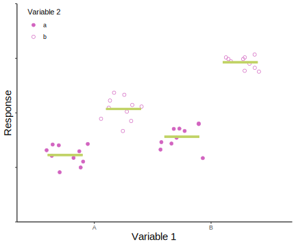
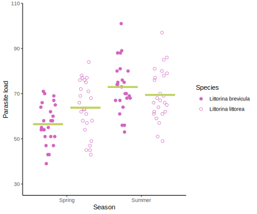

# Two-way ANOVA revisited {#two-way-anova-revisit}

In this chapter we turn our attention to designs with two categorical explanatory variables. We first use the familiar `aov()` function to carry out a two-way ANOVA and then use our understanding to help us interpret the output of `lm()`. We will also make predictions from the model and report on our results.


## Introduction to the example

Researchers have collected live specimens of two species of periwinkle (see Figure \@ref(fig:periwinkle-fig)) from sites in northern England in the Spring and Summer. They take a measure of the gut parasite load by examining a slide of gut contents. The data are in [periwinkle.txt](data-raw/periwinkle.txt).

(ref:periwinkle-fig) Periwinkles are marine gastropod molluscs (slugs and snails). A) *Littorina brevicula* (PD files - Public Domain, https://commons.wikimedia.org/w/index.php?curid=30577419) B) *Littorina littorea*. (photographed by Guttorm Flatabø (user:dittaeva). - Photograph taken with an Olympus Camedia C-70 Zoom digital camera. Metainformation edited with Irfanview, possibly cropped with jpegcrop., CC BY-SA 3.0, https://commons.wikimedia.org/w/index.php?curid=324769

```{r periwinkle-fig, echo = FALSE, fig.cap='(ref:periwinkle-fig)'}
knitr::include_graphics("images/Littorina.jpg")

```


```{r echo =FALSE}
periwinkle <- read_delim("data-raw/periwinkle.txt", delim = "\t")
periwinkle %>% 
  knitr::kable() %>%
  kable_styling()  %>%
  scroll_box(height = "300px")
```

The data were collected to determine whether there was an effect of season or species on parasite load and whether these effects were independent.


:::key
There are 3 variables: `species` and `season`are categorical explanatory variables, each with two levels;
`para`, a continuous variable, is the response.
:::

We can use the `read_delim()` function to import the data.

```{r eval=FALSE}
periwinkle <- read_delim("data-raw/periwinkle.txt", delim = "\t")
```

When visualising this data with `ggplot()` we need to account for both explanatory variables. We can map one to the *x*-axis and the other to a different aesthetic. Using the `fill` aesthetic works well for violin plots. 


```{r}
ggplot(data = periwinkle, aes(x = season, y = para, fill = species)) +
  geom_violin()
```
Parasite load seems to be higher for both species in the summer and that effect looks bigger in *L.brevicula* - it has the lowest spring mean but the highest summer mean.
Let’s create a summary of the data that will be useful for plotting later:
```{r}
peri_summary <- periwinkle %>% 
  group_by(season, species) %>% 
  summarise(mean = mean(para),
            sd = sd(para),
            n = length(para),
            se = sd / sqrt(n))
```

```{r echo=FALSE}
knitr::kable(peri_summary, digits = 2)
```

The summary confirms both species have a higher mean in the summer and that the difference between the species is reversed - *L.brevicula* $-$ *L.littorea* is `r peri_summary$mean[1]-peri_summary$mean[2]` in the spring but `r peri_summary$mean[3]-peri_summary$mean[4]` in summer.

## `aov()` output reminder

The `aov()` function requires a model formula which includes both explanatory variables and the interaction between them in the familiar format: `para ~ season * season` . We also specify the data argument to indicate where the variables can be found:

```{r}
mod <- aov(data = periwinkle, para ~ season * species)
```

The output of the `summary()` function gives us an ANOVA test:

```{r}
summary(mod)
```

```{r echo=FALSE}
res <- summary(mod)[[1]]
df_seas <- res$Df[1]
df_sp <- res$Df[2]
df_seasxsp <- res$Df[3]
df_err <- res$Df[4]
fval_seas <- res$`F value`[1]
fval_sp <- res$`F value`[2]
fval_seasxsp <- res$`F value`[3]
if (res$`Pr(>F)`[1] < 0.001) {
        pval_seas = "< 0.001"
        }
if (res$`Pr(>F)`[1] > 0.001) {
        pval_seas = paste("=", round(res$`Pr(>F)`[1], 3))
        }
if (res$`Pr(>F)`[2] < 0.001) {
        pval_sp = "< 0.001"
        }
if (res$`Pr(>F)`[2] > 0.001) {
        pval_sp = paste("=", round(res$`Pr(>F)`[2], 3))
        }
if (res$`Pr(>F)`[3] < 0.001) {
        pval_seasxsp = "< 0.001"
        }
if (res$`Pr(>F)`[3] > 0.001) {
        pval_seasxsp = paste("=", round(res$`Pr(>F)`[3], 3))
        }
```

There was a significantly greater number of parasites in the Summer than the Spring (ANOVA: $F$ = `r fval_seas`; $d.f.$ = `r df_seas`, `r df_err`; $p$ `r pval_seas`). There was no difference between the species when averaged across the seasons but there was significant interaction (ANOVA: $F$ = `r fval_seasxsp`; $d.f.$ = `r df_seasxsp`, `r df_err`; $p$ `r pval_seasxsp`) between season and species with higher numbers infecting *L.littorea* in the Spring whilst *L.brevicula* was more heavily parasitized in the Summer.
 
We need a post-hoc test to discover which comparisons are significant.

## Post-hoc testing for `aov`
Tukey Honest Significant Difference test is carried out with:
```{r}
TukeyHSD(mod)
```

```{r echo=FALSE}
phres <- TukeyHSD(mod)[["season:species"]]
# line 1
if (phres["Summer:Littorina brevicula-Spring:Littorina brevicula", "p adj"] < 0.001) {
  p_brev = "< 0.001"
}
if (phres["Summer:Littorina brevicula-Spring:Littorina brevicula", "p adj"] > 0.001) {
  p_brev = paste("=", round(phres["Summer:Littorina brevicula-Spring:Littorina brevicula", "p adj"], 3))
}
#line 3
if (phres["Summer:Littorina littorea-Spring:Littorina brevicula", "p adj"] < 0.001) {
  p_sumlit_sprbrev = "< 0.001"
}
if (phres["Summer:Littorina littorea-Spring:Littorina brevicula", "p adj"] > 0.001) {
  p_sumlit_sprbrev = paste("=", round(phres["Summer:Littorina littorea-Spring:Littorina brevicula", "p adj"], 3))
}
# linb 4
if (phres["Spring:Littorina littorea-Summer:Littorina brevicula", "p adj"] < 0.001) {
  p_spr_ln_ls = "< 0.001"
}
if (phres["Spring:Littorina littorea-Summer:Littorina brevicula", "p adj"] > 0.001) {
  p_sprlit_sumbrev = paste("=", round(phres["Spring:Littorina littorea-Summer:Littorina brevicula", "p adj"], 3))
}
```

The parasite load for *L.brevicula* increases significantly between spring and summer ($p$ `r p_brev`) while that for *L.littorea* does not. Other significant comparisons are: the spring load of *L.brevicula* is lower than the summer load of *L.littorea* ($p$ `r p_sumlit_sprbrev`); and summer load of *L.brevicula* is higher than the spring load of *L.littorea* ($p$ `r p_sprlit_sumbrev`).

## Two-way ANOVAs as linear models

The equation for a two-way ANOVA test is an extension of equation \@ref(eq:one-way) for a one-way ANOVA test. It has the same form but an additional parameter. If there are two groups in each explanatory variable, the model is:

\begin{equation}
E(y_{i})=\beta_{0}+\beta_{1}X1_{i}+\beta_{2}X2_{i}+\beta_{3}X1_{i}X2_{i}
(\#eq:one-way)
\end{equation}


The intercept, $\beta_{0}$ is the value of the response when both categorical explanatory variables are at their "lowest" level. $X1_{i}$ is a dummy explanatory variable which indicates the first explanatory variable changing to its second level. It toggles on and off the effects of $\beta_{1}$. $X2_{i}$ is a dummy explanatory variable which indicates the second explanatory variable changing to its second level and toggles on and off the effects of $\beta_{2}$. $\beta_{3}$ is the interaction effect. If $X1_{i}$ and $X2_{i}$ are both 1 $\beta_{3}$ is the extra effect of that combination above the sum of 
$\beta_{1}+\beta_{2}$ 

The number of parameters in a two-way ANOVA design is: the number of levels in one explanatory $\times$ the number of levels in the other explanatory. If each explanatory have three levels, there would be nine $\beta s$

A graphical representation of the terms in a linear model when there are two explanatory variables each with two groups (or levels) is given in Figure \@ref(fig:two-way-annotated). 

(ref:two-way-annotated) A linear model with two explanatory variables each with two levels. 'Variable 1' has levels 'A' and 'B' and 'Variable 2' has levels 'a' and 'b'. Thus there are 2 $\times$ 2 = 4 groups: Aa, Ab, Ba and Bb. The measured `r kableExtra::text_spec("response values are in pink", color = pal3[2], bold = TRUE)` and the `r kableExtra::text_spec("predictions are in green", color = pal3[3], bold = TRUE)`. The residuals are not indicated. The estimated model parameters are indicated: $\beta_{0}$ is the mean of group Aa; $\beta_{1}$ is what has to be added to $\beta_{0}$ to get the mean of group Ab; $\beta_{2}$ is what has to be added to $\beta_{0}$ to get the mean of group Ba; and $\beta_{3}$ is what has to be added to $\beta_{0}$ in addition to $\beta_{1}$ and $\beta_{2}$ to get the mean of group Bb. In this figure, all parameters are positive.  Compare to Figure \@ref(fig:lm-annotated).

```{r two-way-annotated, echo = FALSE, fig.cap="(ref:two-way-annotated)"} 

```

:::key
The intercept, $\beta_{0}$is the response when both explanatory variable is at their first group and all the other $\beta s$ are given relative to this. The interaction parameters give the effect of the combination in addition to the sum of their independent effects
:::

## Applying and interpreting `lm()`
The lm() function is applied to the periwinkle example as follows:
```{r}
mod <- lm(data = periwinkle, para ~ season * species)
```

Printing `mod` to the console gives us the estimated model parameters (coefficients):

```{r}
mod
```

```{r echo=FALSE}
res <- summary(mod)
b0 <- res$coefficients["(Intercept)", "Estimate"]
b1 <- res$coefficients["seasonSummer", "Estimate"]
b2 <- res$coefficients["speciesLittorina littorea", "Estimate"]
b3 <- res$coefficients["seasonSummer:speciesLittorina littorea", "Estimate"]
b0se <- res$coefficients["(Intercept)", "Std. Error"]
b1se <- res$coefficients["seasonSummer", "Std. Error"]
b2se <- res$coefficients["speciesLittorina littorea", "Std. Error"]
b3se <- res$coefficients["seasonSummer:speciesLittorina littorea", "Std. Error"]
tval1 <- res$coefficients["seasonSummer", "t value"]
tval2 <- res$coefficients["speciesLittorina littorea", "t value"]
tval3 <- res$coefficients["seasonSummer:speciesLittorina littorea", "t value"]
df <- res$df[2]

if (res$coefficients["(Intercept)", "Pr(>|t|)"] < 0.001) {
        b0p = "< 0.001"
        }
if (res$coefficients["(Intercept)", "Pr(>|t|)"] > 0.001) {
        b0p = paste("=", round(res$coefficients["(Intercept)", "Pr(>|t|)"], 3))
        }
if (res$coefficients["seasonSummer", "Pr(>|t|)"] < 0.001) {
        b1p = "< 0.001"
        }
if (res$coefficients["seasonSummer", "Pr(>|t|)"] > 0.001) {
        b1p = paste("=", round(res$coefficients["seasonSummer", "Pr(>|t|)"], 3))
}
if (res$coefficients["speciesLittorina littorea", "Pr(>|t|)"] < 0.001) {
        b2p = "< 0.001"
        }
if (res$coefficients["speciesLittorina littorea", "Pr(>|t|)"] > 0.001) {
        b2p = paste("=", round(res$coefficients["speciesLittorina littorea", "Pr(>|t|)"], 3))
}
if (res$coefficients["seasonSummer:speciesLittorina littorea", "Pr(>|t|)"] < 0.001) {
        b3p = "< 0.001"
        }
if (res$coefficients["seasonSummer:speciesLittorina littorea", "Pr(>|t|)"] > 0.001) {
        b3p = paste("=", round(res$coefficients["seasonSummer:speciesLittorina littorea", "Pr(>|t|)"], 3))
        }

rsq <- res$r.squared
if (anova(mod)$`Pr(>F)`[1] < 0.001) {
        modelp = "< 0.001"
        }
if (anova(mod)$`Pr(>F)`[1] > 0.001) {
        modelp = paste("=", round(anova(mod)$`Pr(>F)`[1], 3))
        }

```

The equation for the model is:
<center> $para$ = `r b0` + `r b1`$speciesLittorina littorea$ + `r b2`$seasonSummer:speciesLittorina littorea$</center>

The first group of `season` is `Spring` and the first group of `species` is `Littorina brevicula`so $\beta_{0}$ is the mean of *L.brevicula* in the spring, `r b0`. 

$\beta_{1}$ is the coefficient labelled `seasonSummer` and means when the variable `season` takes the value `Summer`, $\beta_{1}$ must be added to $\beta_{0}$ - the mean of *L.brevicula* in the summer is $\beta_{0}+\beta_{1}$ = `r b0` $+$ `r b1` $=$ `r b0 +b1`.  
The coefficient labelled `speciesLittorina littorea` is $\beta_{2}$. When species becomes `Littorina littorea`, $\beta_{1}$ must be added to $\beta_{0}$ thus the mean of *L.littorea* in spring is $\beta_{0}+\beta_{2}$ = `r b0` $+$ `r b2` $=$ `r b0 +b2`.
If both `season` becomes `Summer` and species becomes `Littorina littorea` you would expect the effect to be $\beta_{0}+\beta_{1}+\beta_{2}$. The coefficient labelled `seasonSummer:speciesLittorina littorea`, $\beta_{3}$ is the effect that is *additional* to that sum. An interaction is when combined effect of two variables is more than just adding the independent effects. The mean of *L.littorea* in summer is $\beta_{0}+\beta_{1}+\beta_{2}+\beta_{3}$ = `r b0` $+$ `rb1` $+$ `r b2` $+$ `rb3` $=$ `r b0 + b1 + b2 +b3`.


More information including statistical tests of the model and its parameters is obtained by using `summary()`:

```{r}
summary(mod)
```
The `Coefficients` table gives the estimated $\beta_{0}$, $\beta_{1}$, $\beta_{2}$ and $\beta_{3}$ again but along with their standard errors and tests of whether the estimates differ from zero. The estimated mean of *L.brevicula* in the spring is `r b0` $\pm$ `r b0se` and this differs significantly from zero ($p$ `r b0p`). The estimated difference between the *L.brevicula* in the spring and *L.brevicula* in the summer `r b1` $\pm$ `r b1se` and also differs significantly from zero ($p$ `r b1p`). The estimated difference between *L.brevicula* in the spring and *L.littorea* in the spring, `r b2` $\pm$ `r b2se` differs significantly from zero ($p$ `r b2p`). 

The proportion of the variance in parasite load explained by the model is `r rsq` and this is a significant proportion of that variance ($p$ `r modelp`). 

As we are fitting three parameters in addition to the intercept our *p*-value for the model and the *p*-values for the $\beta$ parameters differ. This was also true for [one-way ANOVA](#one-way-anova-revisit).

Replacing the terms shown in Figure \@ref(fig:gen_two_way) with the values in this example gives us \@ref(fig:periwinkle-annotated).

(ref:periwinkle-annotated) The annotated model with the values from the parasite load of preiwinkle example. The measured `r kableExtra::text_spec("response values are in pink", color = pal3[2], bold = TRUE)` and the `r kableExtra::text_spec("predictions are in green", color = pal3[3], bold = TRUE)`. The estimated model parameters are indicated: $\beta_{0}$, the mean of *L.brevicula* in the spring, is `r b0`;  $\beta_{1}$ is `r b1` thus the mean of *L.brevicula* in the summer `r b0` + `r b1` = `r b0 + b1`; $\beta_{2}$ is `r b2` thus the mean of *L.littorea* in the spring `r b0` + `r b2` = `r b0 + b1`; and the *L.littorea* in the summer is $\beta_{0}+\beta_{1}+\beta_{2}+\beta_{3}$ = `r b0` $+$ `r b1` $+$ `r b2` $+$ `r b3` $=$ `r b0 + b1 + b2 +b3`. Compare to Figure \@ref(fig:two-way-annotated).

```{r periwinkle-annotated, echo = FALSE, fig.cap="(ref:periwinkle-annotated)"} 

```


## Getting predictions from the model

We already have the predictions for all possible combinations of values of the explanatory variables because both are categorical.

However, the code for using predict is included here, as it was in the previous two chapters chapter, because it will make it easier to understand more complex examples later. We need to create a dataframe of values for which we want predictions and pass it as an argument to the `predict()` function.

To create a dataframe with one column of Species values:

```{r}
predict_for <- data.frame(species = rep(c("Littorina brevicula", "Littorina littorea"), each = 2),
                          season = rep(c("Spring", "Summer"), times = 2))
```

:::key
Remember! The variable and its values have to exactly match those in the model.
:::

The to get the predicted myoglobin content for the three species:

```{r}
predict_for$pred <- predict(mod, newdata = predict_for)
```


## Checking assumptions

The two assumptions of the model can be checked using diagnostic plots. The Q-Q plot is obtained with:

```{r}
plot(mod, which = 2)
```
The residual seem to be normally distributed.

Let’s look at the Residuals vs Fitted plot:

```{r}
plot(mod, which = 1)
```

The residuals are equally spread around a horizontal line; the assumptions seem to be met.


## Post-hoc testing for `lm()`

Instead of using the `TukeyHSD()` we will again use the `glht()` function from the `multcomp` package [@multcomp]. 

A relatively simple way to make all the pairwise comparisons is to create a new factor variable that indicates membership of one of the four groups. We can do that with the `interaction()` function:  
```{r}
periwinkle$seasxspp <- interaction(periwinkle$season, periwinkle$species)
```

```{r echo =FALSE}
periwinkle %>% 
  knitr::kable() %>%
  kable_styling()  %>%
  scroll_box(height = "300px")
```

We then rebuild the model using this one variable:
```{r}
mod2 <- lm(data = periwinkle, para ~ seasxspp)
```

We have done a one-way ANOVA to obtain our post-hoc comparisons. The parameters in this model will be like those in a one-way ANOVA with $\beta_{3}$ giving the amount you add to the intercept to get the fourth group mean. 
Then load the package:
```{r}
library(multcomp)
```

We have to specify our contrasts as a matrix with the `linfct` (linear functions) argument and there is a multiple comparisons function, `mcp()`, to help.

This is the whole command:

```{r}
mod_mc <- glht(mod2, linfct = mcp(seasxspp = "Tukey"))
```
You can read this as "do all of the pairwise comparisons between each group in `seasxspp` in the model `mod` using the Tukey test".

We view the results with `summary()`:

```{r}
summary(mod_mc)
```

The results are the same as for using `TukeyHSD()` as we have done the same tests using a different function.

You can see what a contrasts matrix looks like by looking at the `linfct` variable of the `glht` object. You don't need it now but in the future you may need to specify your own constrasts matrices so let's have a look to make a step towards understanding:

```{r}
mod_mc$linfct
```
It is matrix with a column for each parameter, in order) and a row for each contrast containing only 0s, 1s and -1s. The rows are named.
The numbers are how the model parameters are needed to make the contrast and these can be understood by considering how the group means relate to the parameters.

* Spring.Littorina brevicula mean is $\beta_{0}$ 
* Summer.Littorina brevicula mean is $\beta_{0} + \beta_{1}$ 
* Spring.Littorina littorea $\beta_{0} + \beta_{2}$ 
* Summer.Littorina littorea $\beta_{0} + \beta_{3}$ 

Therefore: 
* Summer.Littorina brevicula - Spring.Littorina brevicula is: $\beta_{0} + \beta_{1} - \beta_{0} = \beta_{1}$ and there is a one in the `seasxsppSummer.Littorina brevicula` column and zeros else where
* Spring.Littorina littorea - Spring.Littorina brevicula is: $\beta_{0} + \beta_{2} - \beta_{0} = \beta_{2}$ and there is a one in the `seasxsppSpring.Littorina littorea` column and zeros else where
* Summer.Littorina littorea - Spring.Littorina brevicula is: $\beta_{0} + \beta_{3} - \beta_{0} = \beta_{3}$ and there is a 1 in the the `seasxsppSummer.Littorina littorea` column and zeros else where
* Spring.Littorina littorea - Summer.Littorina brevicula  is: $\beta_{0} + \beta_{2} - (\beta_{0} + \beta_{1}) = \beta_{2} - \beta_{1}$ and there is a 1 in the the `seasxsppSpring.Littorina littorea` column and a -1 in the `seasxsppSummer.Littorina brevicula` column
* Summer.Littorina littorea - Summer.Littorina brevicula is: $\beta_{0} + \beta_{3} - (\beta_{0} + \beta_{1}) = \beta_{3} - \beta_{1}$ and there is a 1 in the the `seasxsppSummer.Littorina littorea` column and a -1 in the `seasxsppSummer.Littorina brevicula` column
* Summer.Littorina littorea - Spring.Littorina littorea is: $\beta_{0} + \beta_{3} - (\beta_{0} + \beta_{2}) = \beta_{3} + \beta_{2}$ and there is a 1 in the the `seasxsppSummer.Littorina littorea` column and column and a -1 in the `seasxsppSpring.Littorina littorea` colum


## Creating a figure

```{r fig-two-anova}
# palette
# blue, pink, green triadic
pal4 <- c("#256c7a", "#7a256c", "#6c7a25")

ggplot() +
  geom_point(data = periwinkle, aes(x = season,
                                    y = para,
                                    colour = species),
             position = position_jitterdodge(dodge.width = 1,
                                             jitter.width = 0.4,
                                             jitter.height = 0),
             size = 2) +
  geom_errorbar(data = peri_summary, 
                aes(x = season, ymin = mean - se, ymax = mean + se, group = species),
                width = 0.4, size = 1,
                position = position_dodge(width = 1)) +
  geom_errorbar(data = peri_summary, 
                aes(x = season, ymin = mean, ymax = mean, group = species),
                width = 0.3, size = 1,
                position = position_dodge(width = 1) ) +
  scale_x_discrete(name = "Season") +
  scale_y_continuous(name = "Number of parasites",
                     expand = c(0, 0),
                     limits = c(0, 128)) +
  scale_colour_manual(values = pal4[1:2],
                      labels = c(bquote(italic("L.brevicula")),
                                 bquote(italic("L.littorea")))) +
  # Spring:Littorina brevicula-Summer:Littorina littorea *
  annotate("segment", 
           x = 1.25, xend = 1.75, 
           y = 110, yend = 110,
           colour = "black") +
  annotate("segment", 
           x = 1.25, xend = 1.25,
           y = 110, yend = 105,
           colour = "black") +
  annotate("segment", 
           x = 1.75, xend = 1.75,
           y = 110, yend = 105,
           colour = "black") +
  annotate("text", 
           x = 1.5,  y = 112,
           label = "***", size = 6) +
  # Summer:Littorina brevicula-Spring:Littorina littorea: ***
  annotate("segment", 
           x = 1.25, xend = 0.75,
           y = 90, yend = 90,
           colour = "black") +
  annotate("segment", 
           x = 1.25, xend = 1.25,
           y = 90, yend = 85,
           colour = "black") +
  annotate("segment", 
           x = 0.75, xend = 0.75,
           y = 90, yend = 85,
           colour = "black") +
  annotate("text", x = 1,  y = 92,
           label = "*", size = 6) +
# Summer:Littorina littorea-Spring:Littorina littorea: ***
  annotate("segment",
           x = 0.75, xend = 1.75,
           y = 120, yend = 120,
           colour = "black") +
  annotate("segment",
           x = 0.75, xend = 0.75,
           y = 120, yend = 115,
           colour = "black") +
  annotate("segment",
           x = 1.75, xend = 1.75,
           y = 120, yend = 115,
           colour = "black") +
  annotate("text", x = 1.25,  y = 123,
           label = "***", size = 6) +
  theme_classic() +
  theme(legend.title = element_blank(),
        legend.position = c(0.85, 0.98)) 
```


## Reporting the results
*to add: principle, sig, magnitude and direction of effects, test result, figure*

See figure \@ref(fig:fig-two-anova-report).

(ref:fig-two-anova-report) periwinkles blah blah

```{r fig-two-anova-report, ref.label = 'fig-two-anova', echo = FALSE, fig.height=4, fig.width=4, fig.cap="(ref:fig-two-anova-report)", out.width="60%"} 
```

